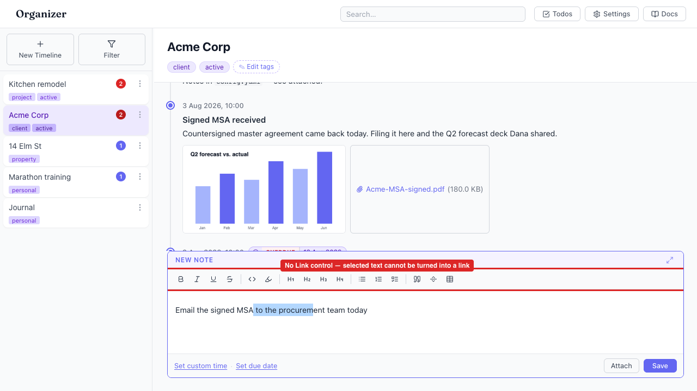
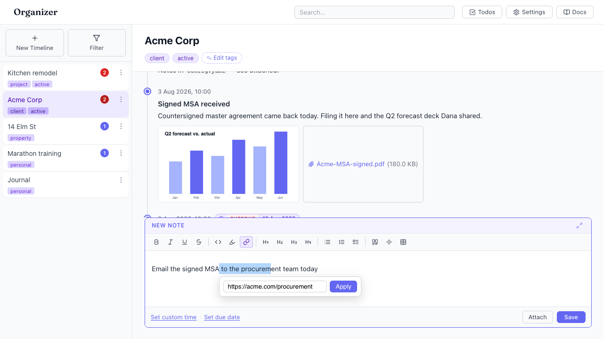

# No toolbar control to add, edit, or remove a link

- Area: entries-composer
- Type: UX
- Severity: High
- Screen/route: `#/timelines/<id>` — `EntryComposer` formatting toolbar (`src/components/EntryComposer/EntryComposer.tsx`)
- Repro:
  1. Open the Acme Corp timeline (seeded).
  2. Click into the "New Note" editor and type: `Email the signed MSA to the procurement team today`.
  3. Select the words `to the procurement`.
  4. Scan the formatting toolbar for a way to turn the selection into a link.
- Observed: There is no link button anywhere in the toolbar (Bold, Italic,
  Underline, Strike, Code, Highlight, H1–H4, lists, task list, blockquote,
  horizontal rule, table — and nothing else). Selected text cannot be made into
  a link, and there is no popover to edit or remove an existing link. The
  `EntryLink` extension is loaded (`extensions` in EntryComposer.tsx:55) and a
  typed URL does autolink, but that is the *only* path to a link — you cannot
  link arbitrary anchor text, fix a wrong URL, or unlink. See ./issue.webm and
  ./issue-1.png.
- Expected / proposed: Add a Link button to the toolbar (next to Highlight)
  that opens a small popover with a URL field + Apply/Remove, operating on the
  current selection via `editor.chain().focus().setLink({ href }).run()` /
  `unsetLink()`. Show the popover when the caret is inside an existing link so
  the URL can be edited or removed.
- Improved demo: ./improved-mockup.png — throwaway tweak: injected a Link button
  (accent-styled, cloned from the Highlight button) after Highlight and a link
  popover (URL input + Apply) anchored to the selection via `run-code`; discarded
  with `reload`. A live functional tweak isn't feasible because the TipTap editor
  instance isn't reachable from injected DOM, so this is an annotated mockup of
  the proposed control.
- Fix pointer: `src/components/EntryComposer/EntryComposer.tsx` (add a
  `ToolbarBtn` + link popover; wire `setLink`/`unsetLink`). The link mark itself
  already exists in `src/components/EntryComposer/linkExtension.ts`
  (`openOnClick: false`). Styling: reuse `.toolBtn` in
  `EntryComposer.module.css`.
- Effort: M

<!-- media-embed:start -->

## Evidence

### Issue

<video controls preload="metadata" width="720" src="./issue.webm"></video>

### Improved

<!-- media-embed:end -->
