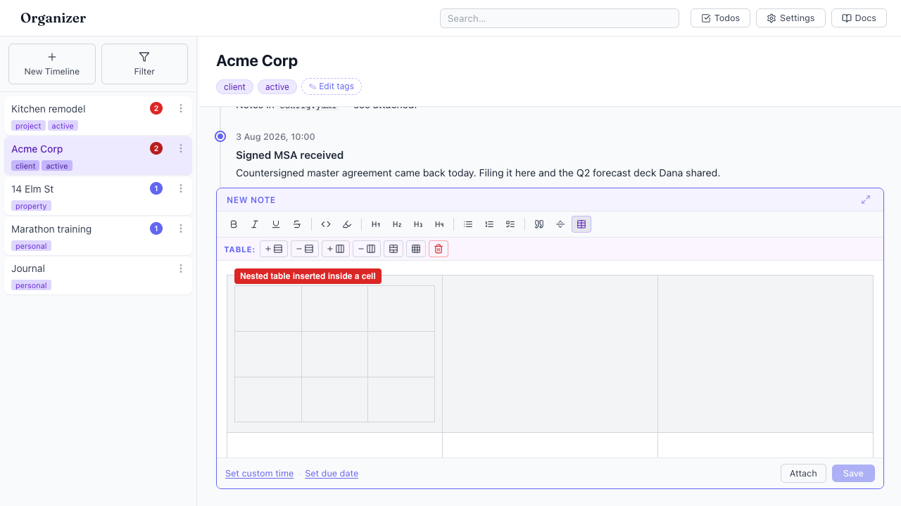

# "Insert table" nests a table inside a table when the caret is already in one

- Area: entries-composer
- Type: Bug
- Severity: Medium
- Screen/route: `#/timelines/<id>` — `EntryComposer` toolbar "Insert table" button (`src/components/EntryComposer/EntryComposer.tsx:241`)
- Repro:
  1. Open the Acme Corp timeline (seeded).
  2. Click into the "New Note" editor.
  3. Click the "Insert table" toolbar button — a 3×3 table appears and the caret lands in it.
  4. Click "Insert table" again.
- Observed: A second 3×3 table is inserted **inside the current cell** — a nested
  table (verified: `document.querySelectorAll('.ProseMirror table table').length === 1`).
  The button shows an "active" highlight while the caret is in a table
  (`active={inTable}`), implying it is a toggle, but clicking it does not toggle
  the table off — it nests a new one. Nested tables are almost never intended and
  render awkwardly. See ./issue.webm and ./issue-1.png.
- Expected / proposed: When the caret is already inside a table, the "Insert
  table" button should be disabled (or a no-op). Table removal already has a
  dedicated control in the table sub-toolbar ("Delete table"), so the main
  button should not double as a toggle. At minimum, guard the click with
  `if (editor.isActive('table')) return;`.
- Improved demo: ./improved.webm — throwaway tweak: set the Insert-table button
  `disabled` (mirrors adding `disabled={inTable}` in JSX) while the caret is in a
  table; a forced click then leaves the table count at 1 with no nesting.
  Discarded with `reload`.
- Fix pointer: `src/components/EntryComposer/EntryComposer.tsx:241` — add
  `disabled={inTable}` to the Insert-table `ToolbarBtn` (the component already
  tracks `inTable` state), or early-return in its `onClick` when
  `editor.isActive('table')`.
- Effort: S

<!-- media-embed:start -->

## Evidence

### Issue

<video controls preload="metadata" width="720" src="./issue.webm"></video>

### Improved

<video controls preload="metadata" width="720" src="./improved.webm"></video>

<!-- media-embed:end -->
