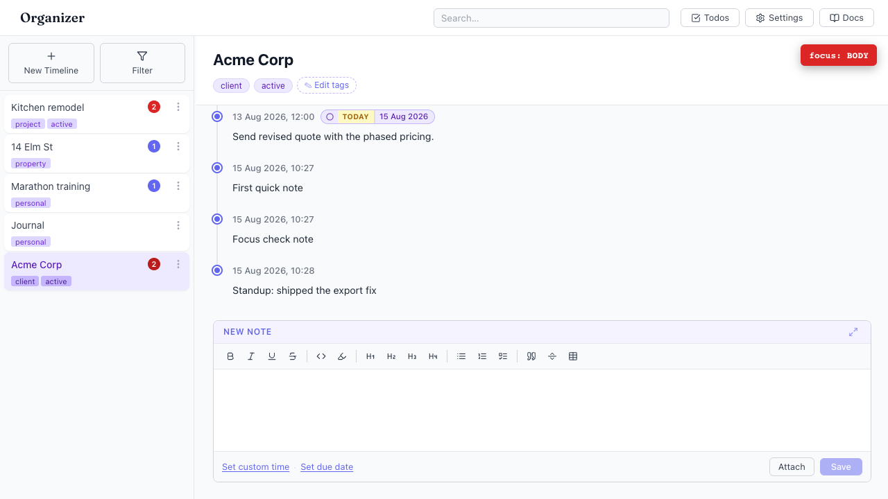
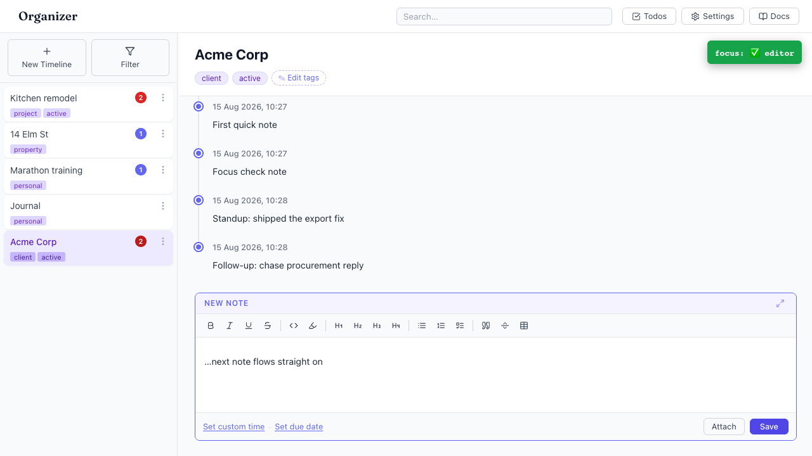

# Composer loses focus after Save (and never gains it on Edit)

- Area: entries-composer
- Type: UX
- Severity: Medium
- Screen/route: `#/timelines/<id>` — `EntryComposer` (`handleSave`, EntryComposer.tsx:155; edit effect, EntryComposer.tsx:84)
- Repro (Save):
  1. Open the Acme Corp timeline (seeded).
  2. Click into "New Note", type `Standup: shipped the export fix`.
  3. Click **Save**.
  4. Without clicking anything, start typing the next note.
- Observed: After Save, `document.activeElement` is `<body>` — the editor is no
  longer focused (the live focus HUD in the video reads **focus: BODY**). Keys
  typed next do not land in the editor; you must click back into it for every new
  note. This breaks the core "add note after note" journaling flow. The same
  focus gap exists when clicking **Edit** on an existing entry: the composer
  switches to "Editing Note" and loads the content, but the editor is not focused
  (`ProseMirror-focused` absent), so the caret isn't placed. See ./issue.webm and
  ./issue-1.png.
- Expected / proposed: After a successful save the editor should refocus so the
  user can immediately type the next entry. Clicking Edit should focus the editor
  (ideally at the end of the content).
- Improved demo: ./improved.webm and ./improved-1.png — throwaway tweak: after
  clicking Save, call `document.querySelector('.ProseMirror').focus()` (the
  equivalent of `editor.commands.focus()`); the HUD flips to **focus: ✅ editor**
  and the next note types straight in with no re-click. Discarded with `reload`.
- Fix pointer: `src/components/EntryComposer/EntryComposer.tsx` — in `handleSave`
  after `editor.commands.clearContent()` add `editor.commands.focus()`; in the
  editing branch of the `[editing, editor]` effect (line ~84) call
  `editor.commands.focus('end')` after `setContent`.
- Effort: S

<!-- media-embed:start -->

## Evidence

### Issue

<video controls preload="metadata" width="720" src="./issue.webm"></video>

### Improved

<video controls preload="metadata" width="720" src="./improved.webm"></video>

<!-- media-embed:end -->
