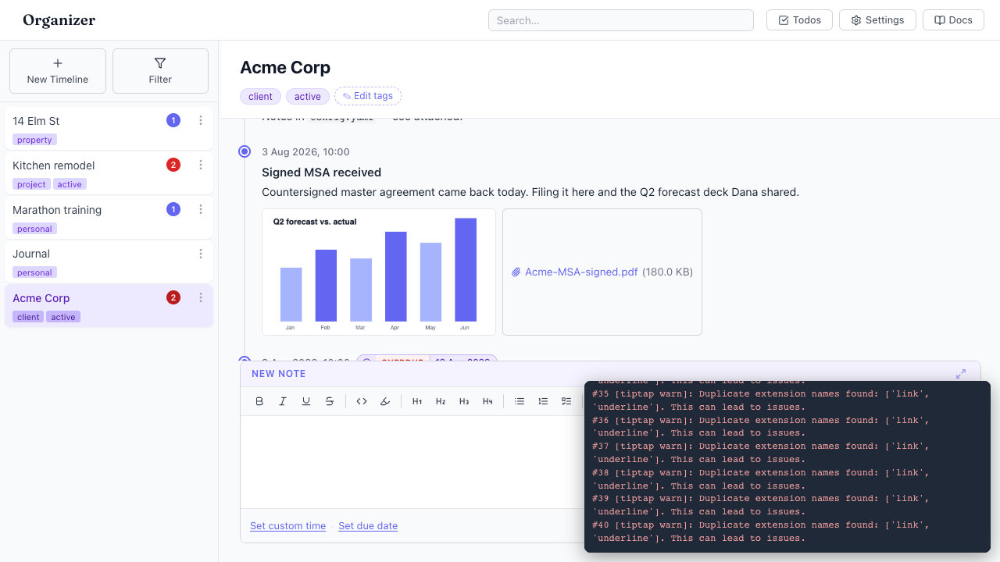
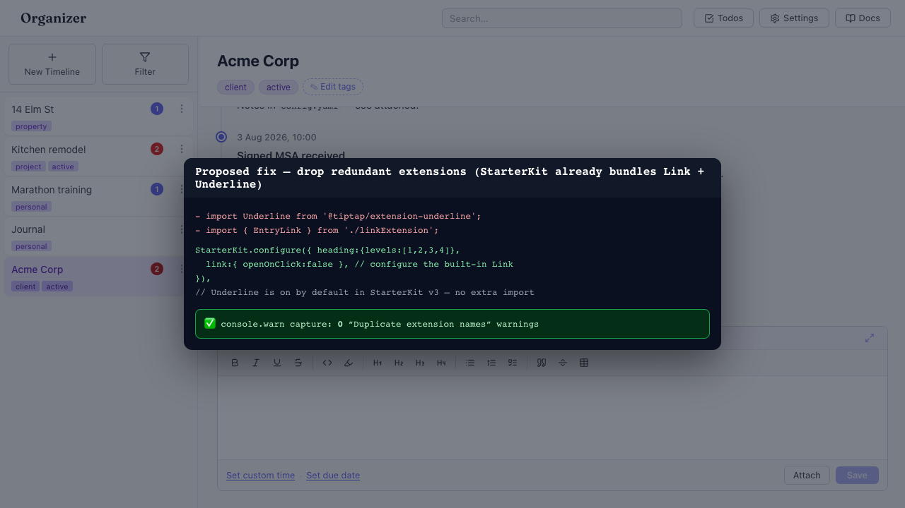

# TipTap "Duplicate extension names" warning spams the console on every render

- Area: entries-composer
- Type: Bug
- Severity: Low
- Screen/route: any `#/timelines/<id>` — `EntryComposer` (extensions, EntryComposer.tsx:51-63) and `EntryCard` (generateHTML, EntryCard.tsx:37-43)
- Repro:
  1. Open the Acme Corp timeline (seeded).
  2. Open the browser console (or watch the on-page `console.warn` capture in the video).
  3. Switch to another timeline and back.
- Observed: The console fills with repeated warnings:
  `[tiptap warn]: Duplicate extension names found: ['link', 'underline']. This can lead to issues.`
  A single timeline switch produced **40** of them (one per EntryCard
  `generateHTML` call plus editor init). See ./issue.webm and ./issue-1.png.
  Root cause (verified): `@tiptap/starter-kit@3.22.5` already bundles both
  `extension-link` and `extension-underline`, yet `EntryComposer` also adds
  `Underline` + `EntryLink`, and `EntryCard` also adds `Underline` + `Link`, on
  top of `StarterKit`. The duplicate mark names collide.
- Expected / proposed: No duplicate-extension warnings. Either disable the
  StarterKit-bundled versions where a custom one is needed
  (`StarterKit.configure({ link: false, underline: false })`, keeping the custom
  `EntryLink` for its non-inclusive behavior), or drop the redundant separate
  imports and configure the built-ins.
- Improved demo: ./improved-mockup.png — a DOM/CSS tweak can't change the
  build-time extension set, so this is an annotated code mockup of the corrected
  extension list plus a "0 warnings" console note.
- Fix pointer: `src/components/EntryComposer/EntryComposer.tsx:51-63` and
  `src/components/EntryCard/EntryCard.tsx:37-43`. Since `EntryLink`
  (`src/components/EntryComposer/linkExtension.ts`) overrides `inclusive()`,
  prefer `StarterKit.configure({ link: false, underline: false })` and keep
  `EntryLink` + `Underline`; make the composer and card extension lists match.
- Effort: S

<!-- media-embed:start -->

## Evidence

### Issue

<video controls preload="metadata" width="720" src="./issue.webm"></video>

### Improved

<!-- media-embed:end -->
