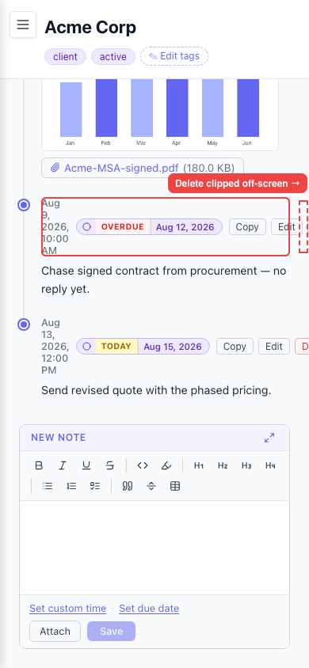
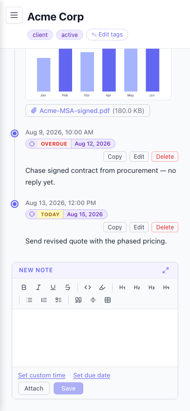

# Entry Copy/Edit/Delete actions clip off-screen on to-do entries (Delete unreachable)

- Area: mobile
- Type: Bug
- Severity: High
- Screen/route: `#/timelines/<id>` — timeline entry cards; `EntryCard` meta row (`src/components/EntryCard/EntryCard.tsx` lines 124–130, `.meta`/`.actions` in `EntryCard.module.css`).
- Repro:
  1. Seed the app (force IndexedDB + skip welcome, then `seedData` from `scripts/seed-and-shoot.mjs`).
  2. Open the **Acme Corp** timeline on a phone viewport (390×844, touch).
  3. Scroll to a to-do entry — e.g. "Chase signed contract from procurement…" (**OVERDUE**) or "Send revised quote…" (**TODAY**).
  4. Look at the entry's meta row: it holds the due-status badge + due-date + **Copy / Edit / Delete**.
- Observed: On any entry that carries a due-date badge, the meta row (`display:flex; align-items:center; no wrap`) is wider than the 390px viewport, so the **Delete** button is pushed past the right edge. Measured `Delete.right = 442px` (viewport 390px). The document does **not** scroll horizontally (`document.documentElement.scrollWidth === 390`), so the clipped Delete button is completely unreachable on mobile — there is no non-hover, non-scroll path to it. Plain entries (no due badge) fit, so this only bites to-do entries. See ./issue.webm and ./issue-1.png.
- Expected / proposed: The full action set (Copy / Edit / Delete) must stay reachable at any viewport width. Let the meta row wrap so the actions fall to a second line, or move Copy/Edit/Delete into an overflow/kebab menu (as timeline rows already do) so width is bounded.
- Improved demo: ./improved.webm (throwaway tweak: injected `[class*="_meta_"] { flex-wrap: wrap !important; row-gap: 6px }` — the real change is adding `flex-wrap: wrap` to `.meta` in `EntryCard.module.css`). Actions wrap to a second line and Delete becomes fully visible; the date also stops breaking vertically. Still: ./improved-1.png. Tweak discarded via `reload`.
- Fix pointer: `src/components/EntryCard/EntryCard.module.css` `.meta` (line 51 — add `flex-wrap: wrap`) and/or restructure the `.actions` group (`EntryCard.tsx` 124–130) into an overflow menu. Consider a small `@media (max-width: 768px)` rule so wrapping only applies on narrow screens.
- Effort: S

<!-- media-embed:start -->

## Evidence

### Issue

<video controls preload="metadata" width="720" src="./issue.webm"></video>

### Improved

<video controls preload="metadata" width="720" src="./improved.webm"></video>

<!-- media-embed:end -->
