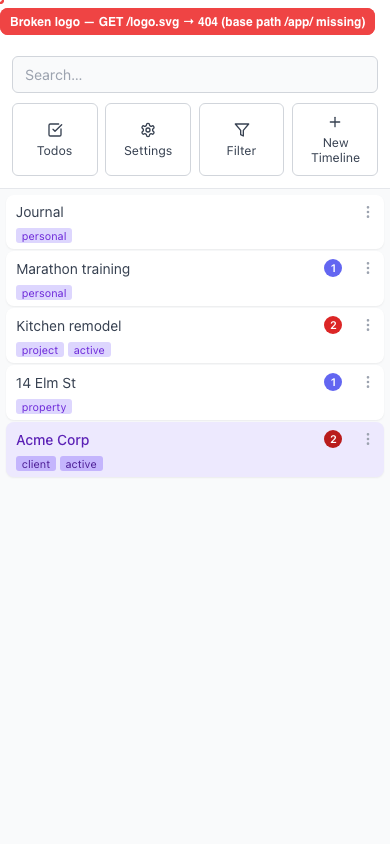

# Header/app logo is a broken image (src `/logo.svg` ignores the `/app/` base path)

- Area: mobile
- Type: Bug
- Severity: Medium
- Screen/route: Global chrome — mobile drawer header, home/empty state, and `AppBanner`. Most visible on mobile because the drawer header logo sits top-left next to search.
- Repro:
  1. Seed the app and load it at a phone viewport (390×844).
  2. Tap the hamburger ("Toggle menu") to open the drawer — the logo is top-left, beside the search box.
  3. (Also visible: `console` shows `GET http://localhost:5174/logo.svg 404`.)
- Observed: The logo renders as a broken-image placeholder. The `` src is the root-absolute `/logo.svg`, but the app is served under the base path `/app/`, so the browser requests `http://localhost:5174/logo.svg` → **404** (`naturalWidth === 0`). Verified: `curl /app/logo.svg` → 200, `curl /logo.svg` → 404. Two `` elements are affected. See ./issue.webm and ./issue-1.png. Console evidence recorded during the run (repeated `Failed to load resource: 404 … /logo.svg`).
- Expected / proposed: The logo should load. The src must be resolved against Vite's base URL, e.g. `` `${import.meta.env.BASE_URL}logo.svg` `` (which becomes `/app/logo.svg`), or a bundled import of the asset.
- Improved demo: ./improved.webm (throwaway tweak: `document.querySelectorAll('img').forEach(i => { if (/\/logo\.svg$/.test(i.src)) i.src = '/app/logo.svg' })`). The logo renders correctly (`naturalWidth > 0`). Tweak discarded via `reload`.
- Fix pointer: `src/App.tsx` lines 192, 250, 331 and `src/components/AppBanner/AppBanner.tsx` line 14 — replace `src="/logo.svg"` with `` src={`${import.meta.env.BASE_URL}logo.svg`} ``. Note `src/App.test.tsx` line 74 asserts the literal `'/logo.svg'`, so update that expectation too.
- Effort: S

<!-- media-embed:start -->

## Evidence

### Issue

<video controls preload="metadata" width="720" src="./issue.webm"></video>

### Improved

<video controls preload="metadata" width="720" src="./improved.webm"></video>

<!-- media-embed:end -->
