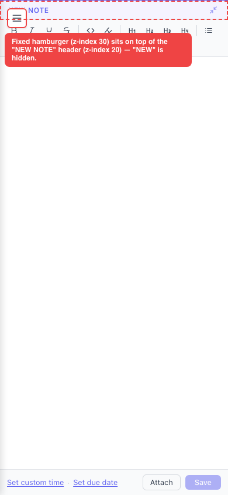

# Fullscreen composer header is overlapped by the fixed hamburger menu button

- Area: mobile
- Type: Style
- Severity: Low
- Screen/route: `#/timelines/<id>` — expanded `EntryComposer` (`.expanded` / `.composerLabel` in `src/components/EntryComposer/EntryComposer.module.css`) vs the mobile menu button (`.mobileBurger` in `src/App.module.css`).
- Repro:
  1. Seed the app and open the **Acme Corp** timeline at a phone viewport (390×844).
  2. In the "New Note" composer, tap the **Expand editor** (⤢) button to go fullscreen.
  3. Look at the top-left of the composer header.
- Observed: The fullscreen composer (`position:absolute; inset:0; z-index:20`) fills the pane, but the mobile hamburger (`.mobileBurger`, `position:fixed; top:14px; left:12px; z-index:30`) stays painted on top of it and covers the start of the "NEW NOTE" title — only "NOTE" is visible. Measured overlap: burger box x12–46 / y14–48 sits over the label starting at x14. See ./issue.webm and ./issue-1.png.
- Expected / proposed: In fullscreen the header title must not be obscured. Either indent the fullscreen header so the title clears the fixed button, or hide the hamburger while the composer is expanded (it isn't needed there), or lift the expanded composer above the burger and offset its top padding.
- Improved demo: ./improved.webm (throwaway tweak: injected `[class*="_expanded_"] [class*="_composerLabel_"] { padding-left: 56px !important }`). The "NEW NOTE" title shifts right and is fully readable. Tweak discarded via `reload`.
- Fix pointer: `src/components/EntryComposer/EntryComposer.module.css` — add a rule so `.expanded .composerLabel` gets left padding on mobile (or set the expanded composer `z-index` above `.mobileBurger` and pad the top). Alternatively hide `.mobileBurger` (`src/App.module.css` line 433) while a composer is expanded.
- Effort: S

<!-- media-embed:start -->

## Evidence

### Issue

<video controls preload="metadata" width="720" src="./issue.webm"></video>

### Improved

<video controls preload="metadata" width="720" src="./improved.webm"></video>

<!-- media-embed:end -->
