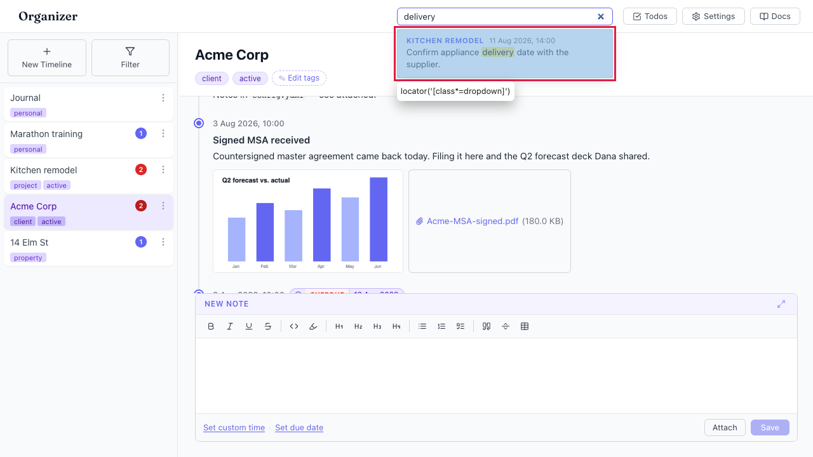

# Search results cannot be navigated or activated with the keyboard

- Area: search
- Type: Bug
- Severity: High
- Screen/route: global header `SearchBox` (`src/components/SearchBox/SearchBox.tsx`), the results dropdown (`.dropdown`)
- Repro:
  1. Boot the seeded app (5 timelines / 17 entries).
  2. Click the header search box and type `delivery`.
  3. The results dropdown opens with matches.
  4. Press `ArrowDown` a few times, then press `Enter`.
- Observed: Arrow keys do nothing — no result is highlighted, focus stays in the
  input, and `aria-activedescendant` stays `null`. `Enter` does not open the
  first/any result: the route does not change and the dropdown stays open. The
  results list is only reachable with a mouse. There are also no combobox
  semantics (the input has no `role="combobox"`, `aria-expanded`,
  `aria-controls`; the dropdown has no `role="listbox"`), so assistive tech is
  never told results exist. See ./issue.webm and ./issue-1.png.
- Expected / proposed: `ArrowDown`/`ArrowUp` should move a visible highlight
  through the results (with `aria-activedescendant` tracking it), `Enter` should
  open the highlighted result (or the first result when none is highlighted),
  and the input/dropdown should expose combobox/listbox roles so screen readers
  announce the list.
- Improved demo: ./improved.webm (throwaway tweak: injected a `keydown` listener
  on the search input plus a `.audit-active` style; ArrowDown/Up move an
  inset-bar highlight through the results and Enter dispatches the result's
  handler — the video shows the route changing on Enter. Discarded on reload.)
- Fix pointer: `src/components/SearchBox/SearchBox.tsx` — add an `activeIndex`
  state, an `onKeyDown` handler on the `<input>` for ArrowDown/ArrowUp/Enter/
  Escape, `role="combobox"`/`aria-expanded`/`aria-controls`/`aria-activedescendant`
  on the input and `role="listbox"`/`role="option"` on the dropdown/results; add
  an active-item style in `SearchBox.module.css`.
- Effort: M

<!-- media-embed:start -->

## Evidence

### Issue

<video controls preload="metadata" width="720" src="./issue.webm"></video>

### Improved

<video controls preload="metadata" width="720" src="./improved.webm"></video>

<!-- media-embed:end -->
