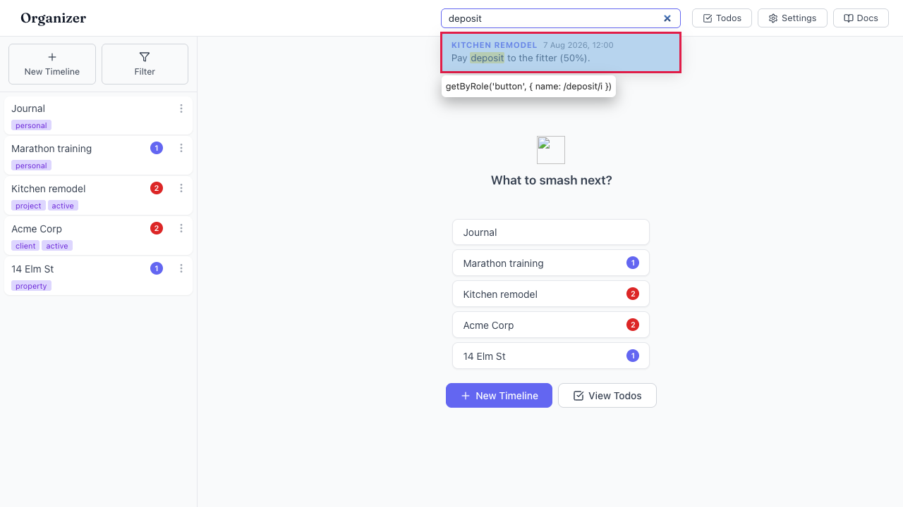

# A focused search result cannot be activated with Enter/Space (mouse-only)

- Area: search
- Type: Bug
- Severity: High
- Screen/route: global header `SearchBox` results dropdown — the result
  `<button>` (`src/components/SearchBox/SearchBox.tsx`, `onMouseDown={() => handleSelect(r)}`)
- Repro:
  1. Boot the seeded app; you are on `#/` (home).
  2. Click the header search box and type `deposit` (one result, in Kitchen remodel).
  3. Press `Tab` — focus lands on the result `<button>` (dropdown stays open).
  4. Press `Enter`, then `Space`.
- Observed: Nothing happens. The route stays `#/`; the result is not opened.
  Each result is wired only to `onMouseDown`, and keyboard activation of a
  `<button>` fires `click` (and Space fires on keyup), never `mousedown` — so a
  keyboard or assistive-tech user who reaches the result can never trigger it.
  See ./issue.webm and ./issue-1.png.
- Expected / proposed: A focused result must activate on `Enter` and `Space`
  (i.e. respond to `click`, not only `mousedown`). Selecting with the mouse must
  keep working. (The `onMouseDown` was likely chosen so selection beats the
  outside-`mousedown` close handler — the fix should preserve that ordering,
  e.g. keep closing logic from firing before an `onClick` navigation.)
- Improved demo: ./improved.webm (throwaway tweak: added a capture-phase
  `keydown` listener that, when a `.result` button is focused and Enter/Space is
  pressed, dispatches the button's `mousedown` — the video shows Tab→Enter now
  navigating to the Kitchen remodel timeline. Discarded on reload.)
- Fix pointer: `src/components/SearchBox/SearchBox.tsx` line ~147 — replace the
  `onMouseDown`-only handler with an `onClick` (guarding the outside-mousedown
  close so click selection still lands), or add `onKeyDown` handling for
  Enter/Space on each result.
- Effort: S

<!-- media-embed:start -->

## Evidence

### Issue

<video controls preload="metadata" width="720" src="./issue.webm"></video>

### Improved

<video controls preload="metadata" width="720" src="./improved.webm"></video>

<!-- media-embed:end -->
