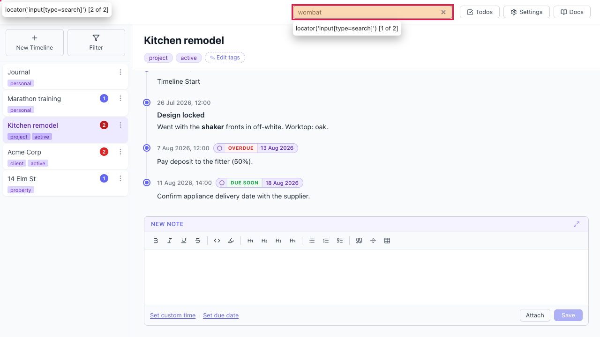
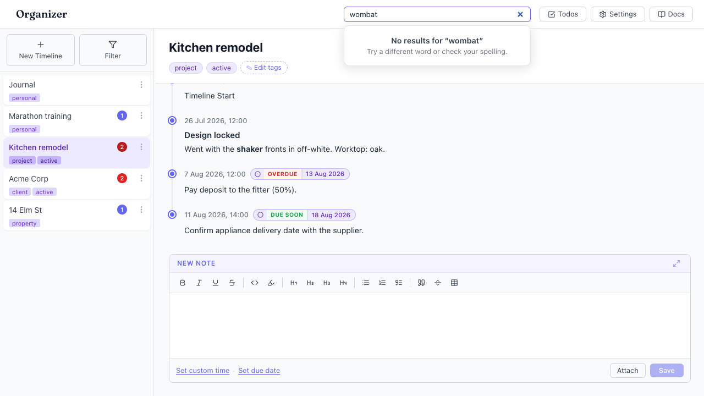

# No "no results" state — a query with no matches shows nothing

- Area: search
- Type: UX
- Severity: Medium
- Screen/route: global header `SearchBox` (`src/components/SearchBox/SearchBox.tsx`)
- Repro:
  1. Boot the seeded app.
  2. Click the header search box and type a term that matches nothing, e.g. `wombat`.
- Observed: The dropdown never appears and no message is shown. The box looks
  exactly like an idle search box, so the user cannot tell whether the query
  matched nothing, whether search is still loading, or whether search is broken.
  Cause: the effect does `setOpen(scored.length > 0)` and the JSX only renders
  when `open && results.length > 0`, so an empty result set produces no UI at
  all. See ./issue.webm and ./issue-1.png.
- Expected / proposed: When the query is non-empty and there are zero matches,
  open the dropdown with an explicit empty state, e.g. "No results for
  '<query>'" plus a hint ("Try a different word or check your spelling.").
- Improved demo: ./improved.webm and ./improved-mockup.png (throwaway tweak:
  injected a fixed-position panel under the search input showing "No results for
  'wombat'" with a hint, styled like the real dropdown. Discarded on reload.)
- Fix pointer: `src/components/SearchBox/SearchBox.tsx` — track whether the query
  is non-empty separately from result count; open the dropdown when
  `queryWords.length > 0` and render a no-results branch when `results.length === 0`.
  Add an `.empty`/`.noResults` style in `SearchBox.module.css`.
- Effort: S

<!-- media-embed:start -->

## Evidence

### Issue

<video controls preload="metadata" width="720" src="./issue.webm"></video>

### Improved

<video controls preload="metadata" width="720" src="./improved.webm"></video>

<!-- media-embed:end -->
