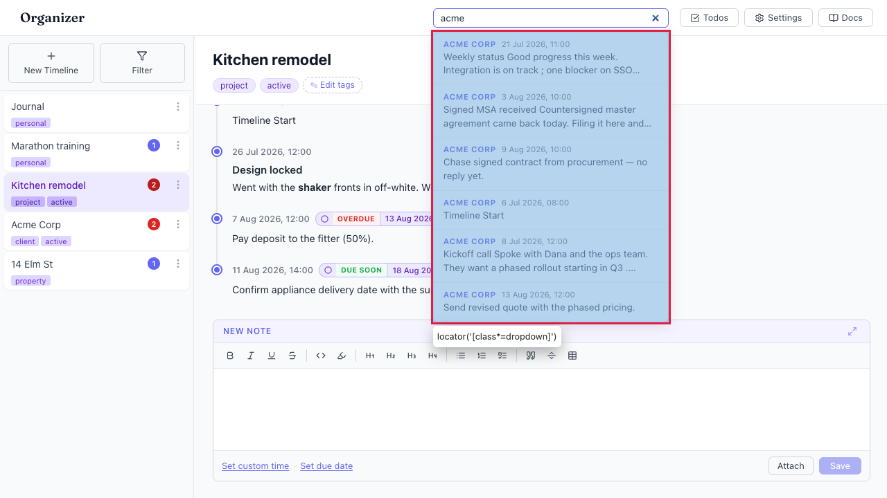
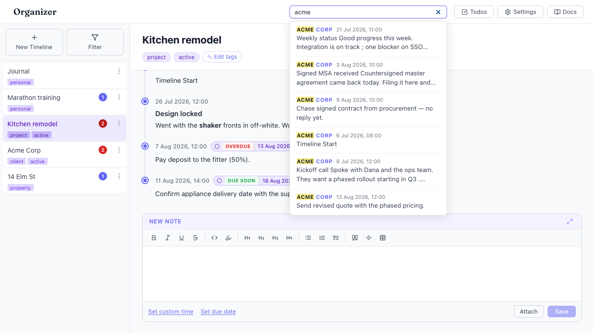

# Matches in the timeline name are not highlighted — results look unrelated

- Area: search
- Type: UX
- Severity: Medium
- Screen/route: global header `SearchBox` results dropdown
  (`src/components/SearchBox/SearchBox.tsx` — `highlightSnippet` only runs over
  the snippet, and `timelineName` is rendered as plain text)
- Repro:
  1. Boot the seeded app.
  2. Click the header search box and type `acme` (matches the Acme Corp
     timeline name — so every Acme entry scores a hit).
- Observed: Six results appear, all from "Acme Corp", but the query word is not
  highlighted anywhere — `hasMark` is false in the whole dropdown. Highlighting
  is only ever applied to the entry snippet (via `highlightSnippet`), and the
  match here is in the timeline name, which is rendered as plain text. The user
  sees six results whose snippets never contain "acme" and cannot tell why they
  matched. See ./issue.webm and ./issue-1.png.
- Expected / proposed: When the query matches the timeline name (or an
  attachment name), highlight that match too — at minimum highlight the matched
  substring in the `.timelineName` label so the reason for the result is visible.
- Improved demo: ./improved.webm and ./improved-mockup.png (throwaway tweak: for
  each visible result, wrapped the matched substring inside the `.timelineName`
  span in a `<mark>` styled like the existing snippet highlight — "ACME" now
  reads as highlighted in every result. Discarded on reload.)
- Fix pointer: `src/components/SearchBox/SearchBox.tsx` — reuse `highlightSnippet`
  (or a shared highlighter) on `r.timeline.name` where it is rendered (~line 150),
  and consider highlighting matched attachment names as well.
- Effort: S

<!-- media-embed:start -->

## Evidence

### Issue

<video controls preload="metadata" width="720" src="./issue.webm"></video>

### Improved

<video controls preload="metadata" width="720" src="./improved.webm"></video>

<!-- media-embed:end -->
