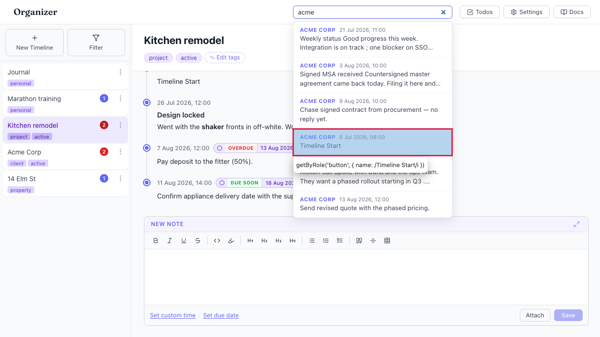
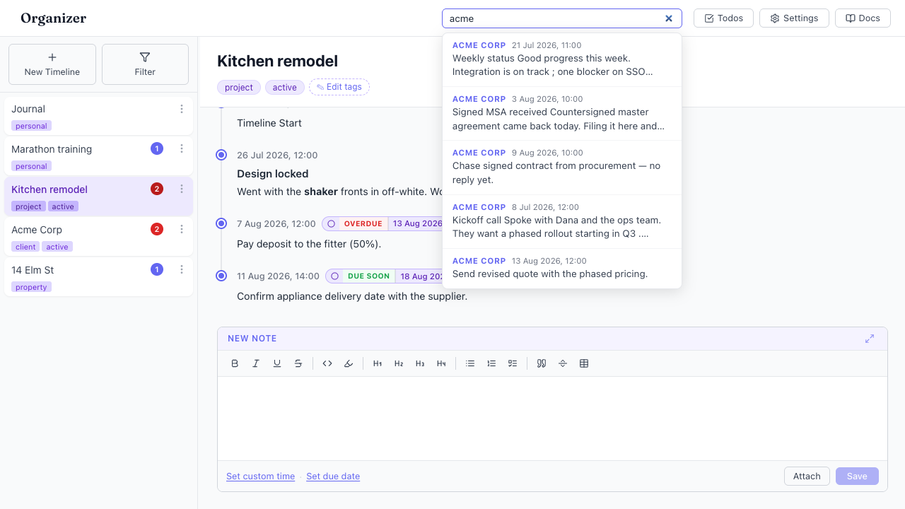

# Internal "Timeline Start" marker entries pollute search results

- Area: search
- Type: UX
- Severity: Low
- Screen/route: global header `SearchBox` results dropdown
  (`src/components/SearchBox/SearchBox.tsx` — the scoring loop iterates every
  entry including `isStart` markers)
- Repro:
  1. Boot the seeded app (each timeline has an `isStart: true` "Timeline Start" entry).
  2. Click the header search box and type `acme` — one of the six results is the
     Acme "Timeline Start" marker.
  3. Or type `start` — 5 of the 7 results are "Timeline Start" markers.
- Observed: The `isStart` placeholder entries (content = "Timeline Start") are
  indexed and surfaced as normal search results. They carry no user content, so
  they are noise: with `acme` one slot is wasted on a marker, and with `start`
  the results are dominated by markers. Selecting one just opens the timeline at
  its empty beginning. See ./issue.webm and ./issue-1.png.
- Expected / proposed: Exclude `isStart` marker entries from the search index
  (they are internal anchors, not content), so results only contain real entries.
- Improved demo: ./improved.webm and ./improved-mockup.png (throwaway tweak: hid
  every result whose snippet is exactly "Timeline Start" — the Acme results
  collapse to real entries only. Discarded on reload.)
- Fix pointer: `src/components/SearchBox/SearchBox.tsx` — in the scoring loop
  (~line 92) skip entries where `entry.isStart` before scoring.
- Effort: S

<!-- media-embed:start -->

## Evidence

### Issue

<video controls preload="metadata" width="720" src="./issue.webm"></video>

### Improved

<video controls preload="metadata" width="720" src="./improved.webm"></video>

<!-- media-embed:end -->
