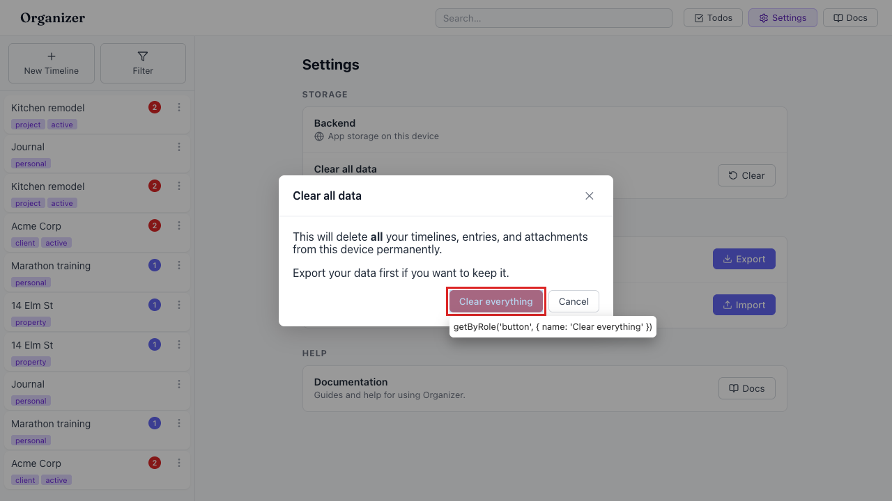

# "Clear all data" deletes nothing — destructive action is a no-op

- Area: settings
- Type: Bug
- Severity: Critical
- Screen/route: `#/settings` → Storage card → "Clear all data" row; confirm modal "Clear everything" button. Component `src/components/Settings/Settings.tsx` (`handleReset`, lines 39-42).
- Repro:
  1. Seed the app (5 timelines) and open `#/settings`.
  2. In the Storage card, click **Clear** on the "Clear all data" row.
  3. In the confirmation modal ("This will delete all your timelines… permanently"), click **Clear everything**.
  4. Observe the app navigates to home (`#/`).
  5. Inspect the sidebar / IndexedDB: all timelines and entries are still present.
- Observed: `handleReset()` only calls `setResetModalOpen(false)` and `navigate('/', { replace: true })`. It never touches the storage adapter, so **no timelines, entries, or attachments are removed**. Verified in-browser: 10 timelines before → 10 after clicking "Clear everything". The modal copy promises permanent deletion, but nothing is deleted. See ./issue.webm and ./issue-1.png.
- Expected / proposed: "Clear everything" must actually wipe all data via the storage adapter — delete every timeline, entry, and blob (mirroring the `mode: 'replace'` branch of `importData` in `src/utils/exportImport.ts`, which already deletes all timelines/entries/blobs) — then call `onDataChanged()` and navigate home. A no-op destructive control is worse than none: users believe their data is gone when it is not (a privacy/safety hazard on shared devices).
- Improved demo: ./improved.webm (throwaway tweak: a capture-phase click listener was attached to the "Clear everything" button that `clear()`s the `timelines`, `entries`, and `blobs` object stores in the `timeline-app` IndexedDB, then navigates home and reloads. After the tweak the timeline count went from 5 → 0, i.e. the intended behavior.)
- Fix pointer: `src/components/Settings/Settings.tsx` `handleReset` — make it `async`, delete all data through `useStorage().adapter` (getAllTimelines/getAllEntries/getAllBlobKeys → deleteTimeline/deleteEntry/deleteBlob), `await onDataChanged()`, then navigate. Reuse the deletion logic already in `src/utils/exportImport.ts` (`importData` replace branch). Consider extracting a shared `clearAllData(adapter)` helper.
- Effort: M

<!-- media-embed:start -->

## Evidence

### Issue

<video controls preload="metadata" width="720" src="./issue.webm"></video>

### Improved

<video controls preload="metadata" width="720" src="./improved.webm"></video>

<!-- media-embed:end -->
