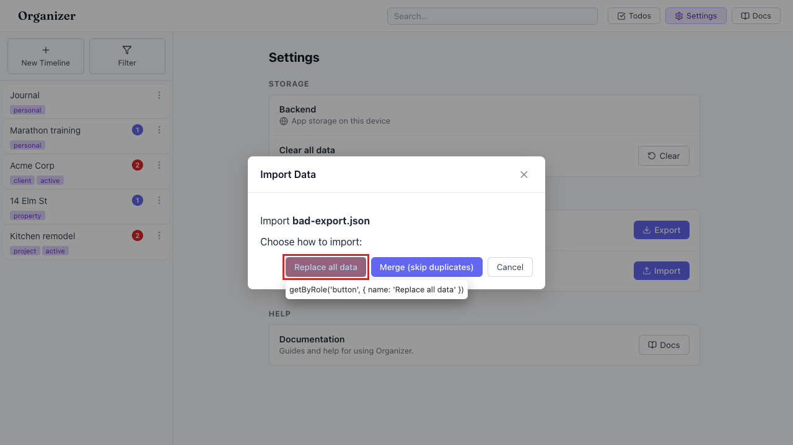
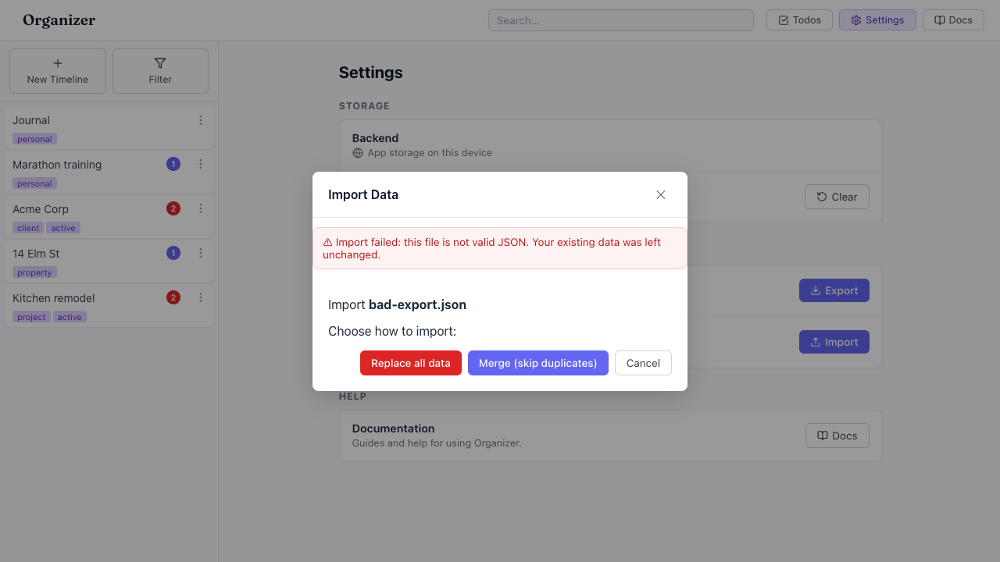

# Importing malformed JSON fails silently — no error shown to the user

- Area: settings
- Type: Bug
- Severity: High
- Screen/route: `#/settings` → Backup card → "Import" → Import Data modal. Components `src/components/Settings/Settings.tsx` (`handleImport`, lines 26-37) and `src/utils/exportImport.ts` (`importData`, line 41 `JSON.parse`).
- Repro:
  1. Seed the app and open `#/settings`.
  2. Click **Import** and choose any file that is not valid JSON (e.g. a text file with `.json` extension, or a truncated export).
  3. In the "Import Data" modal, click **Replace all data** (or **Merge**).
  4. Observe the modal simply closes.
- Observed: `importData` calls `JSON.parse(text)` with no error handling; `handleImport` wraps the call in `try { … } finally { … }` with **no `catch`**. On bad input the parse throws, the `finally` still closes the modal and clears the file, and the rejection surfaces only in the devtools console:
  `SyntaxError: Unexpected token 'h', "this is { n"... is not valid JSON at importData (exportImport.ts:38) at async handleImport (Settings.tsx:27)`.
  The user sees the modal vanish exactly as it would on success — there is **no toast, banner, or message** telling them the import failed. See ./issue.webm and ./issue-1.png. (Confirmed via `playwright-cli console`.)
- Expected / proposed: Catch parse/validation errors in `handleImport` and show a clear, visible error (toast or in-modal banner) such as "Import failed: this file is not valid JSON. Your existing data was left unchanged." Keep the modal open so the user can retry or cancel. Ideally also validate the parsed object shape (has `version`, `timelines`, `entries`) before touching storage. Note: existing data currently survives because `JSON.parse` runs before the replace-deletions, but that is incidental, not signalled.
- Improved demo: ./improved.webm and ./improved-mockup.png (throwaway tweak: a capture-phase listener on the "Replace all data" button that, instead of the silent handler, injects a red error banner into the modal reading "Import failed: this file is not valid JSON. Your existing data was left unchanged." — demonstrating the missing feedback. Discarded on reload.)
- Fix pointer: `src/components/Settings/Settings.tsx` `handleImport` — add `catch (err) { showError(...) }`, keep modal open on failure. Surface errors through the existing `ToastStack` (see `src/context/StorageContext.tsx` / `src/components/Toast/Toast.tsx`). Optionally add shape validation in `src/utils/exportImport.ts` `importData`.
- Effort: S

<!-- media-embed:start -->

## Evidence

### Issue

<video controls preload="metadata" width="720" src="./issue.webm"></video>

### Improved

<video controls preload="metadata" width="720" src="./improved.webm"></video>

<!-- media-embed:end -->
