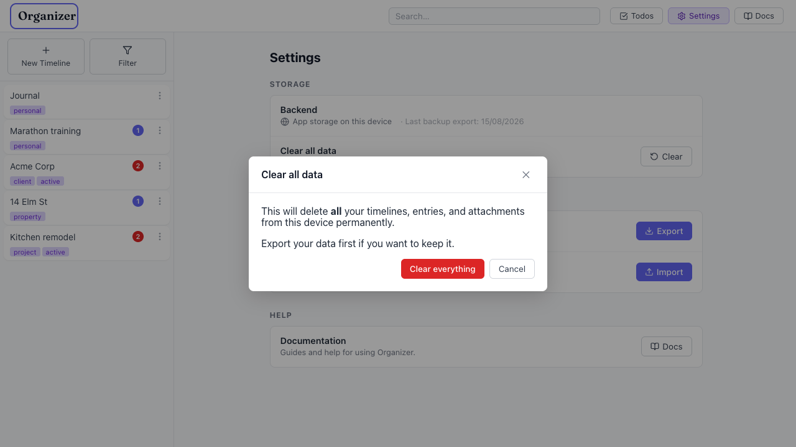

# Modals don't manage focus — no initial focus, no focus trap, keyboard escapes to background

- Area: settings
- Type: Bug
- Severity: High
- Screen/route: `#/settings` → any modal ("Clear all data" confirm, "Import Data"). Component `src/components/Modal/Modal.tsx` (used by `src/components/Settings/Settings.tsx` lines 133-171).
- Repro:
  1. Open `#/settings` and click **Clear** (or **Import** → pick a file) to open a modal.
  2. Observe where keyboard focus is: it stays on the background trigger button, not in the dialog.
  3. Press **Tab** repeatedly.
  4. Watch focus walk out of the dialog and into the page/nav behind the overlay.
- Observed: `Modal.tsx` only wires up an Escape-to-close handler. It never moves focus into the dialog on open, never traps Tab within it, and never restores focus on close. Verified in-browser: after opening the Clear modal, `document.activeElement` was still the background **Clear** button; after 6 Tabs, focus was on the top nav (`insideDialog: false`) while the modal was still visible. This is a WCAG 2.4.3 / 2.1.2 failure — keyboard and screen-reader users can interact with obscured background content, and the dialog is announced without receiving focus. The impact is worst on the destructive "Clear all data" and "Import → Replace all data" dialogs. See ./issue.webm and ./issue-1.png (red outline = a background element that received focus while the modal was open).
- Expected / proposed: On open, move focus into the dialog (to a safe control — Cancel, or the dialog container). Trap Tab / Shift+Tab within the dialog's focusable elements. On close, restore focus to the element that opened it. Also add `aria-modal` is present but focus management is the missing half.
- Improved demo: ./improved.webm (throwaway tweak: injected an initial `.focus()` onto the Cancel button plus a `keydown` Tab handler on the `[role=dialog]` that wraps focus between the first and last focusable elements. After the tweak, 6 Tabs kept focus inside the dialog — ending on "Cancel", `insideDialog: true`. Discarded on reload.)
- Fix pointer: `src/components/Modal/Modal.tsx` — on mount, store `document.activeElement`, focus the dialog (the `ref` is already there), add a Tab-trap keydown handler scoped to the modal, and restore focus in the cleanup. This fixes every modal in the app at once.
- Effort: M

<!-- media-embed:start -->

## Evidence

### Issue

<video controls preload="metadata" width="720" src="./issue.webm"></video>

### Improved

<video controls preload="metadata" width="720" src="./improved.webm"></video>

<!-- media-embed:end -->
