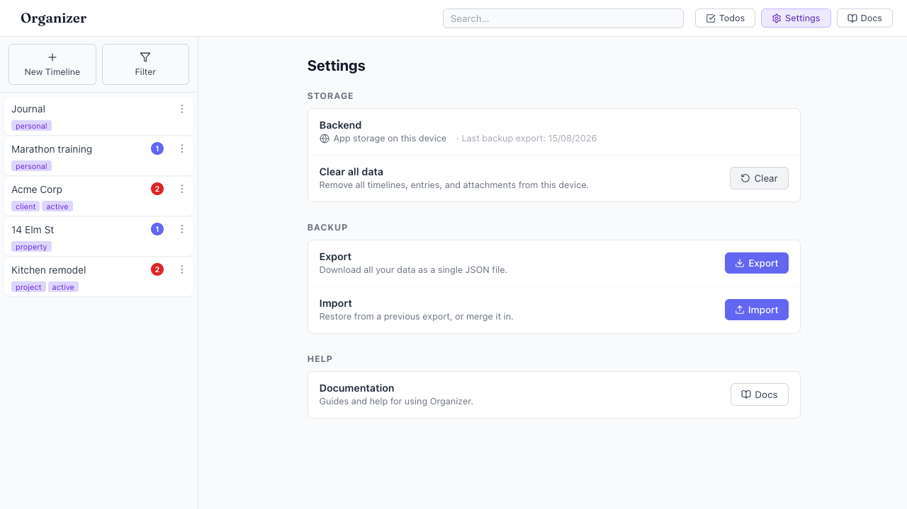
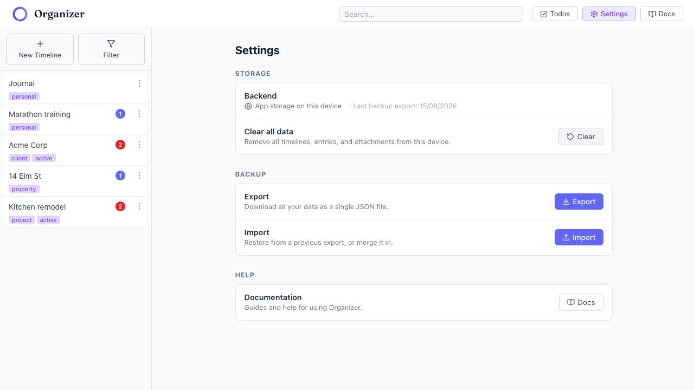

# App logo 404s — hard-coded `/logo.svg` ignores the `/app/` base path

- Area: settings (app-wide; console error present on the Settings route)
- Type: Bug
- Severity: Medium
- Screen/route: Every route including `#/settings`. Console shows `GET http://localhost:5174/logo.svg 404`. The `` tags live in `src/App.tsx` (lines 192, 250, 331) and `src/components/AppBanner/AppBanner.tsx` (line 14). `public/logo.svg` exists and is correctly served at `/app/logo.svg`.
- Repro:
  1. Boot the app at `http://localhost:5174/app/` and open `#/settings`.
  2. Run `playwright-cli console` — a 404 for `/logo.svg` is logged on every page load.
  3. Look at the sidebar header: the logo icon is missing (the `` collapses to 0×34 next to the "Organizer" wordmark).
- Observed: The app is served under Vite `base: '/app/'` (see `vite.config.ts` line 37), but the logo is referenced with a root-absolute path `/logo.svg`, which resolves to `http://localhost:5174/logo.svg` → **404**. `curl` confirms `/logo.svg` = 404 while `/app/logo.svg` = 200. In-browser the `` elements report `naturalWidth: 0` (load failed); the visible sidebar instance renders as an empty/broken image with an empty `alt`. See ./issue.webm and ./issue-1.png (dashed outline = where the logo should be).
- Expected / proposed: Reference the asset through the base path so it loads under `/app/`. Use Vite's `import.meta.env.BASE_URL` (e.g. `` `${import.meta.env.BASE_URL}logo.svg` ``) or import the asset so Vite rewrites the URL. This fixes the console 404 and restores the logo everywhere.
- Improved demo: ./improved.webm and ./improved-mockup.png (throwaway tweak: rewrote each `img[src="/logo.svg"]` to `/app/logo.svg`; the image then loaded with `naturalWidth: 150`. Discarded on reload.)
- Fix pointer: `src/App.tsx` (lines 192, 250, 331), `src/components/AppBanner/AppBanner.tsx` (line 14) — replace `"/logo.svg"` with `` `${import.meta.env.BASE_URL}logo.svg` `` (or an `import logoUrl from '.../logo.svg'`). Note `src/App.test.tsx` line 74 asserts the literal `/logo.svg` and will need updating.
- Effort: S

<!-- media-embed:start -->

## Evidence

### Issue

<video controls preload="metadata" width="720" src="./issue.webm"></video>

### Improved

<video controls preload="metadata" width="720" src="./improved.webm"></video>

<!-- media-embed:end -->
