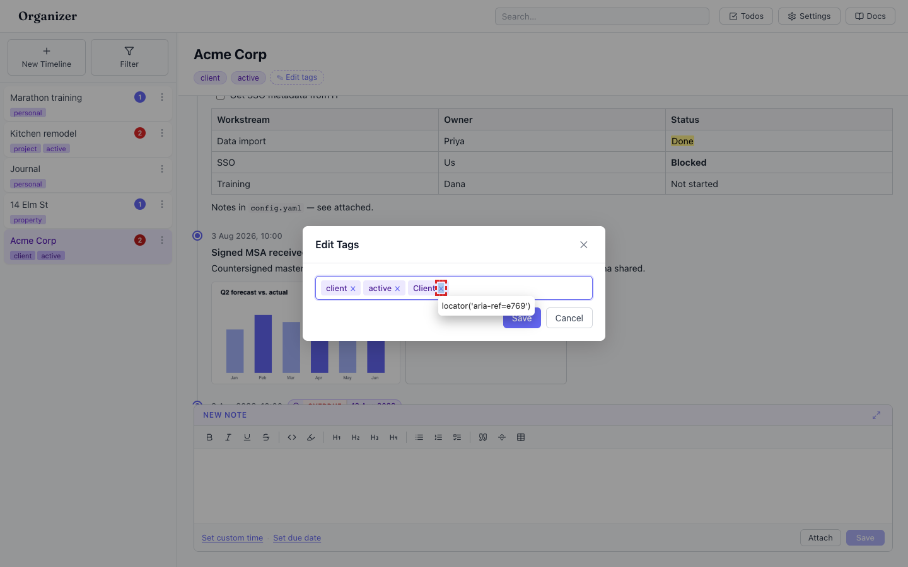
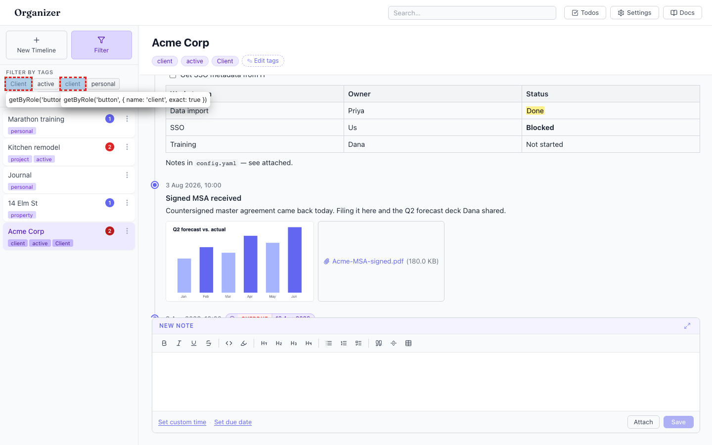
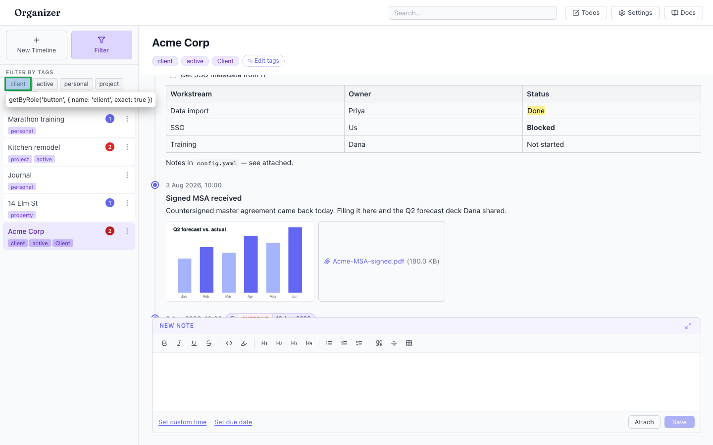

# Duplicate tags allowed when they differ only by letter case

- Area: tags
- Type: Bug
- Severity: Medium
- Screen/route: `#/timelines/<id>` → "Edit Tags" modal (`TagInput`); consequences surface in the sidebar `TagFilter`. Components: `src/components/TagInput/TagInput.tsx`, `src/hooks/useTags.ts`, `src/components/TagFilter/TagFilter.tsx`.
- Repro:
  1. Boot the seeded app on the Acme Corp timeline (tags: `client`, `active`).
  2. Click **✎ Edit tags** in the timeline header.
  3. Type `Client` (capital C) into the tag field and press **Enter**.
  4. Observe both `client` and `Client` now sit as separate chips. Click **Save**.
  5. Open the sidebar **Filter** panel.
- Observed: `TagInput` accepts `Client` as a brand-new tag even though `client` already exists — its dedup check (`!tags.includes(trimmed)`, TagInput.tsx:27) is an exact, case-sensitive match. After saving, the timeline carries two near-identical tags, and because `useTags` collects tags into a case-sensitive `Set`, the filter panel lists `Client` and `client` as two independent chips. Filtering by one misses timelines tagged with the other, silently splitting the tag. See ./issue.webm, ./issue-1.png (two chips in the modal) and ./issue-2.png (two chips in the filter).
- Expected / proposed: Tag entry should be case-insensitive for duplicate detection — typing `Client` when `client` exists should be treated as the same tag (either rejected as a duplicate or normalised to the existing casing). The filter list should then show a single `client` chip.
- Improved demo: ./improved.webm (throwaway tweak: injected JS that lower-cases each `.tag` filter chip and hides any whose normalised label was already seen — i.e. what a case-insensitive dedup would produce; only one `client` chip remains). Also ./improved-1.png. Reverted with `reload`.
- Fix pointer: `src/components/TagInput/TagInput.tsx` `addTag()` (line ~26-29) — compare `trimmed.toLowerCase()` against existing tags lower-cased before pushing; optionally reuse the existing tag's canonical casing. Consider also normalising in `src/hooks/useTags.ts` so historical mixed-case data collapses in the filter.
- Effort: S

<!-- media-embed:start -->

## Evidence

### Issue

<video controls preload="metadata" width="720" src="./issue.webm"></video>

### Improved

<video controls preload="metadata" width="720" src="./improved.webm"></video>

<!-- media-embed:end -->
