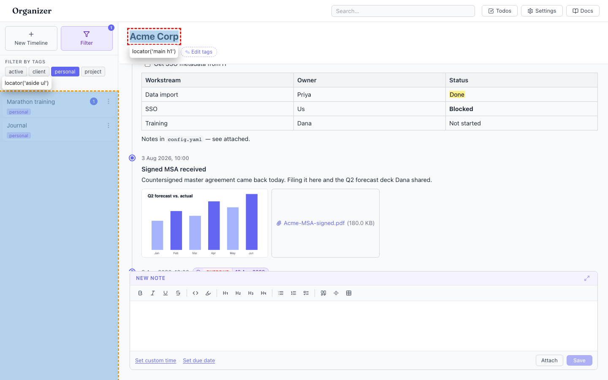
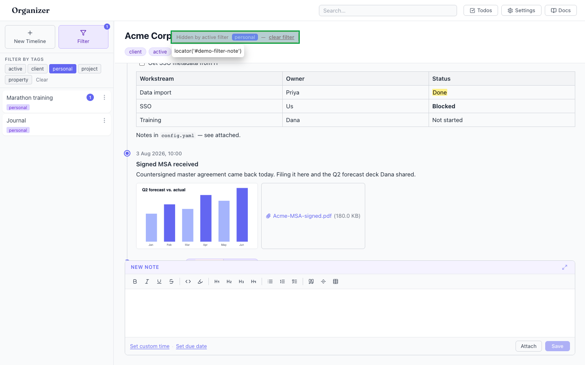

# Tag filter never reflected in the main view — the open timeline stays visible even when it is filtered out

- Area: tags
- Type: UX
- Severity: Low
- Screen/route: Sidebar `TagFilter` vs. main `TimelineView` header. Components: `src/components/TimelineList/TimelineList.tsx` (filtering, line 50-52), `src/App.tsx` (main render), `src/components/TimelineView/TimelineView.tsx`.
- Repro:
  1. Boot the seeded app — it opens on **Acme Corp** (tags `client`, `active`).
  2. Open the sidebar **Filter** panel and click **personal**.
  3. The list narrows to Marathon training + Journal; Acme is filtered out.
- Observed: The filter only affects the sidebar list. The main pane still shows the full **Acme Corp** timeline with no indication that the active timeline is no longer in the filtered set — the header shows nothing about the active filter, and the currently-open timeline "disappears" from the sidebar while remaining fully open. Verified: `main h1 = "Acme Corp"` while `acmeInList = false`. This is disorienting: the user filters, the open item vanishes from the list, yet the content pane is unchanged and gives no cue why. See ./issue.webm and ./issue-1.png (main heading highlighted red, filtered list highlighted amber).
- Expected / proposed: When a tag filter is active, reflect it where the user is looking — e.g. a small "filtered by <tag>" chip in the main header, and/or a hint when the open timeline is excluded by the current filter ("This timeline is hidden by the active filter — clear filter"). At minimum the active filter state should be discoverable from the main pane, not only the sidebar.
- Improved demo: ./improved.webm (throwaway tweak: injected a "Hidden by active filter · personal · clear filter" notice directly under the main `h1`). Also ./improved-1.png. Reverted with `reload`.
- Fix pointer: lift `filterTags` so the main view can read it (currently local to `TimelineList`), then surface it in `TimelineView`'s header or in `App.tsx` around the `<TimelineView>` render.
- Effort: M

<!-- media-embed:start -->

## Evidence

### Issue

<video controls preload="metadata" width="720" src="./issue.webm"></video>

### Improved

<video controls preload="metadata" width="720" src="./improved.webm"></video>

<!-- media-embed:end -->
