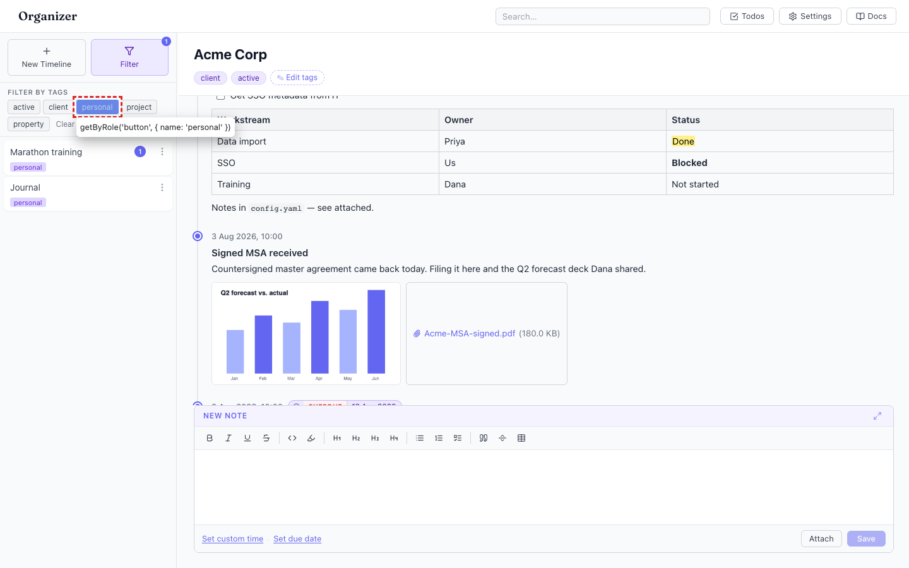
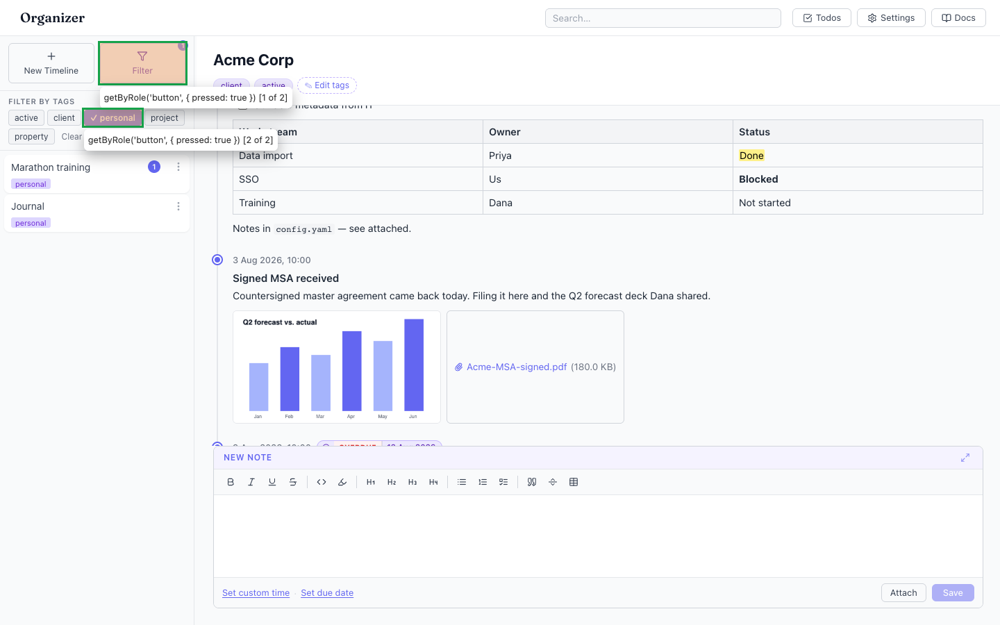

# Tag filter buttons expose selected state by colour only — no `aria-pressed` for assistive tech

- Area: tags
- Type: Bug
- Severity: Medium
- Screen/route: Sidebar filter panel — `src/components/TagFilter/TagFilter.tsx` (lines 25-33).
- Repro:
  1. Boot the seeded app.
  2. Open the sidebar **Filter** panel.
  3. Click **personal** to select it (it turns indigo).
  4. Inspect the tag `<button>` elements.
- Observed: `TagFilter` renders each tag as a plain `<button>` and marks the selected one only with a `.active` CSS class (indigo background + white text). There is no `aria-pressed` (or `role="option"` / `aria-selected`) on any tag button — verified in the DOM: every tag button, selected or not, reports `aria-pressed: null`. A screen-reader user hears "personal, button" with no indication that it is a toggle or that it is currently on; the selected state is communicated purely through colour, which also fails WCAG 1.4.1 (Use of Color) as the sole differentiator. See ./issue.webm and ./issue-1.png.
- Expected / proposed: Each tag button is a toggle and should be marked as one: add `aria-pressed={selected}` (the sidebar Filter button itself already does this correctly at TimelineList.tsx:96). Consider a non-colour affordance too (checkmark / border) so the on/off state is perceivable without relying on hue.
- Improved demo: ./improved.webm (throwaway tweak: injected `aria-pressed` on every tag button reflecting its `.active` class, and added a `✓` + bold weight to the selected tag as a non-colour cue). Also ./improved-1.png; the selected tag is now reachable via `getByRole('button', { pressed: true })`. Reverted with `reload`.
- Fix pointer: `src/components/TagFilter/TagFilter.tsx` — add `aria-pressed={selected.includes(tag)}` to each tag `<button>`; optionally add a check/indicator element in the `.active` state in `TagFilter.module.css`.
- Effort: S

<!-- media-embed:start -->

## Evidence

### Issue

<video controls preload="metadata" width="720" src="./issue.webm"></video>

### Improved

<video controls preload="metadata" width="720" src="./improved.webm"></video>

<!-- media-embed:end -->
