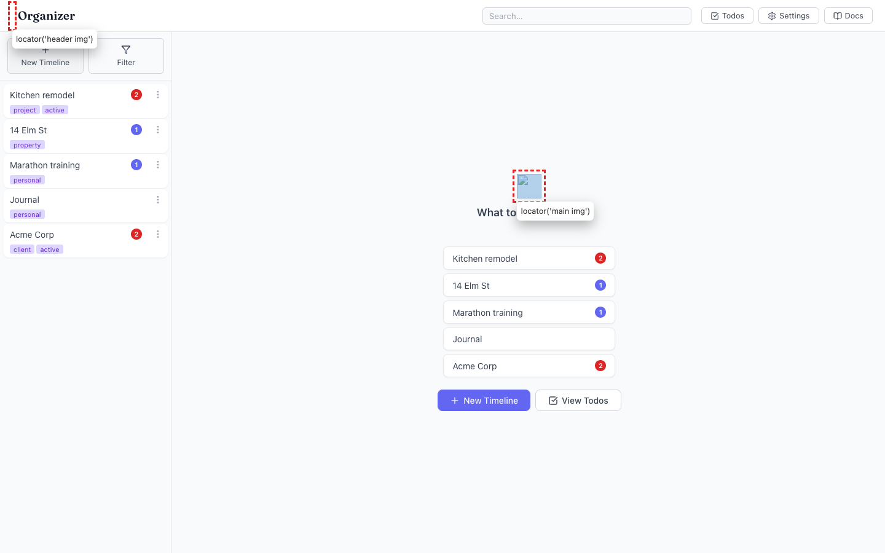
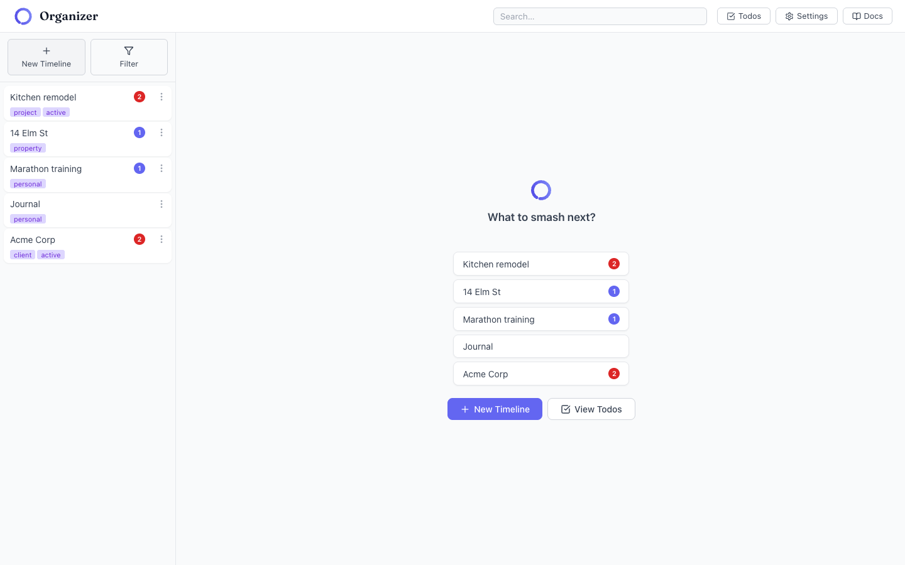

# App logo is broken everywhere (404 on `/logo.svg`)

- Area: timelines
- Type: Bug
- Severity: High
- Screen/route: All routes. Empty state `#/` (`App.tsx` `emptyLogo`), header wordmark (`App.tsx` `appLogo`), and mobile brand button. Element: ``.
- Repro:
  1. Boot the seeded app at `http://localhost:5174/app/`.
  2. Navigate to home/empty state (`#/`) — the big brand logo above "What to smash next?".
  3. Observe the header logo next to the "Organizer" wordmark.
  4. Open DevTools console / network.
- Observed: Every logo renders as a broken image. The console logs `Failed to load resource: 404 (Not Found) @ http://localhost:5174/logo.svg`. In the DOM all three `` have `naturalWidth === 0` (broken). See ./issue.webm and ./issue-1.png (three broken-image boxes outlined in red: empty-state logo + header logo).
- Root cause: Vite is served under `base: '/app/'` (see `vite.config.ts:37`), but the app references the logo with a root-absolute path `/logo.svg`, which resolves to `http://localhost:5174/logo.svg` (404). The asset actually lives at `/app/logo.svg` (verified: `/app/logo.svg` → 200, `/logo.svg` → 404; file is `public/logo.svg`).
- Expected / proposed: The logo should load on every route. Reference the asset through the Vite base path, e.g. `src={` + "`${import.meta.env.BASE_URL}logo.svg`" + `}` (yields `/app/logo.svg`), or a base-relative `logo.svg`.
- Improved demo: ./improved.webm (throwaway tweak: ran `document.querySelectorAll('img[src="/logo.svg"]').forEach(i => i.src = '/app/logo.svg')` in the page — all three logos then render, `naturalWidth` becomes 150). Also ./improved-1.png. Tweak discarded via reload.
- Fix pointer: `src/App.tsx` — the three `` occurrences (header `appLogo` ~line 192, mobile brand ~line 250, empty-state `emptyLogo` ~line 331). Grep for other root-absolute `src="/..."` asset references too. Prefer `import.meta.env.BASE_URL`.
- Effort: S

<!-- media-embed:start -->

## Evidence

### Issue

<video controls preload="metadata" width="720" src="./issue.webm"></video>

### Improved

<video controls preload="metadata" width="720" src="./improved.webm"></video>

<!-- media-embed:end -->
