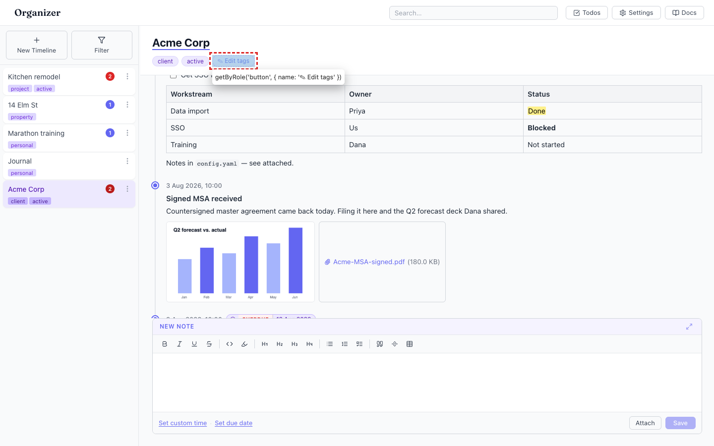
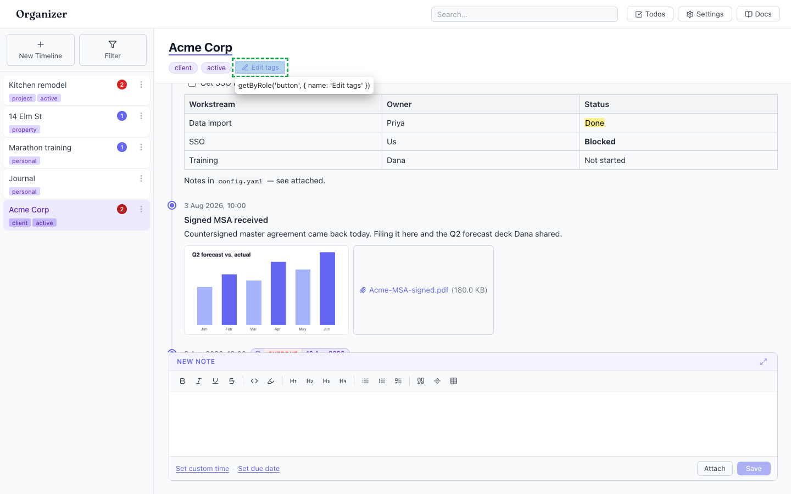

# Emoji/dingbat glyphs used as UI icons on the tag buttons

- Area: timelines
- Type: Style
- Severity: Low
- Screen/route: `#/timelines/<id>` — `TimelineView` tags row. Element: `<button class="editTagsBtn">` (`src/components/TimelineView/TimelineView.tsx:145`).
- Repro:
  1. Open a timeline that has tags (e.g. Acme Corp) — the button reads "✎ Edit tags".
  2. Open a timeline with no tags — the same button reads "+ Add tags".
- Observed: The button prefixes its label with a raw glyph rendered as a UI icon: `✎` is U+270E (LOWER RIGHT PENCIL, a dingbat), and `+` is a literal plus character. Verified in the DOM: label text `"✎ Edit tags"`, first codepoint `0x270e`. This violates UI_STANDARDS.md #5 ("Use real icons, not emoji, for UI") and is visually inconsistent with the app's lucide icon set (used everywhere else — Plus, Filter, MoreVertical, CheckSquare, etc.). Dingbats/emoji render differently per OS/font. See ./issue.webm and ./issue-1.png (button outlined).
- Expected / proposed: Use lucide icons for the affordance — e.g. `<Pencil size={14} />` for "Edit tags" and `<Plus size={14} />` for "Add tags" — matching the rest of the chrome, and lay the button out as an icon+text flex row.
- Improved demo: ./improved.webm and ./improved-1.png (throwaway tweak: replaced the button's inner content with an inline lucide `pencil` SVG + "Edit tags" and set `display:inline-flex; align-items:center`). Tweak discarded via reload.
- Fix pointer: `src/components/TimelineView/TimelineView.tsx:144-146` (`editTagsBtn` label; import `Pencil`, `Plus` from `lucide-react`) and `.editTagsBtn` in `src/components/TimelineView/TimelineView.module.css` (add `display:inline-flex; gap` for icon spacing).
- Effort: S

<!-- media-embed:start -->

## Evidence

### Issue

<video controls preload="metadata" width="720" src="./issue.webm"></video>

### Improved

<video controls preload="metadata" width="720" src="./improved.webm"></video>

<!-- media-embed:end -->
