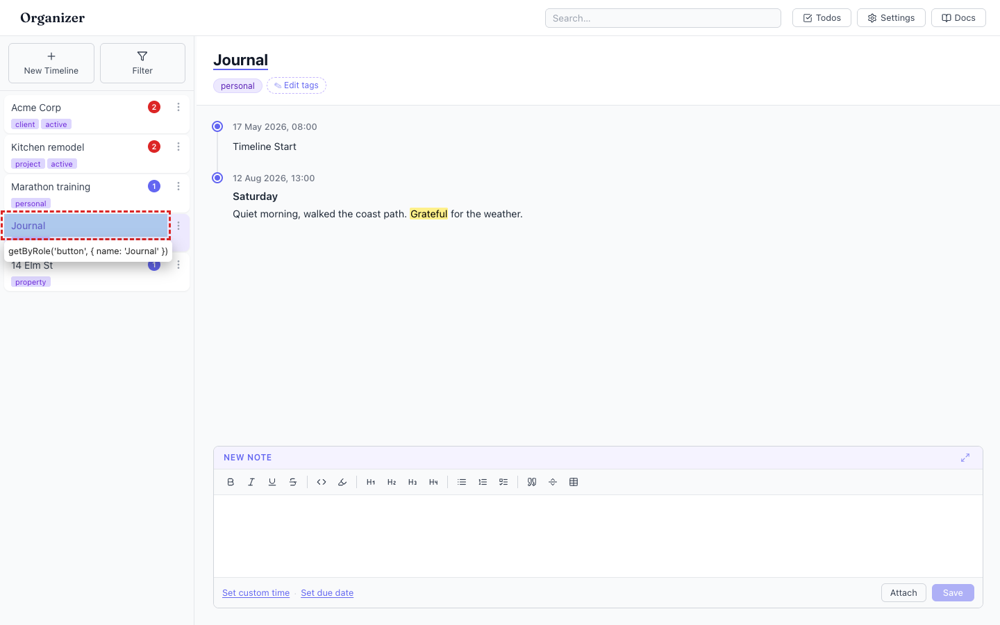
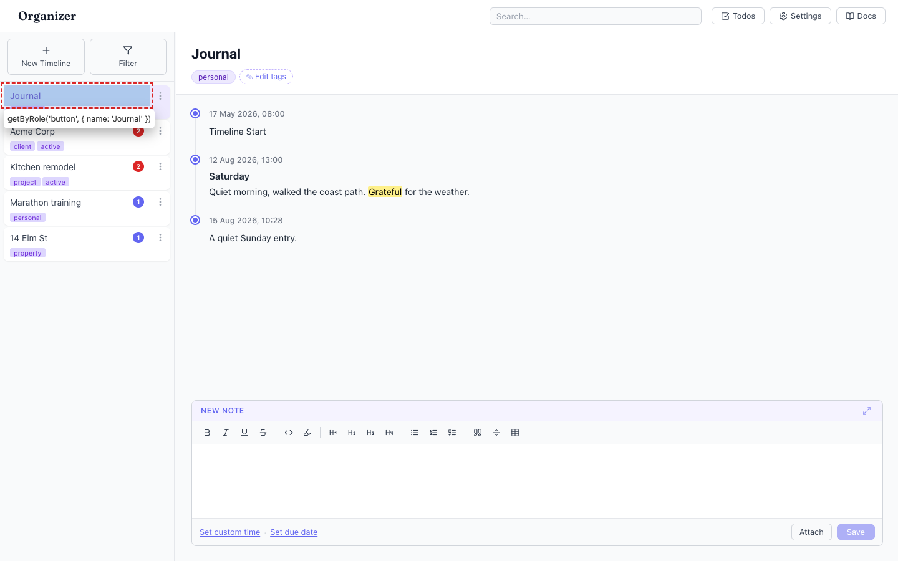
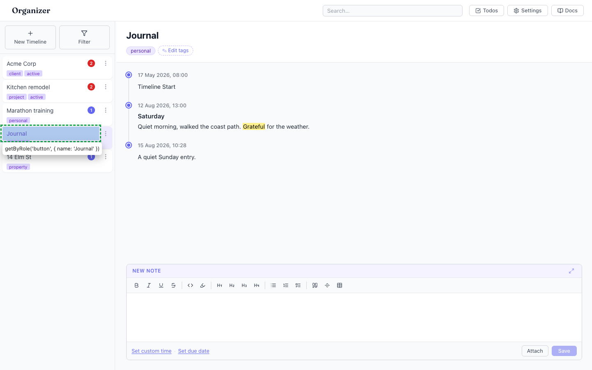

# Sidebar reorders under you: the active timeline jumps to the top on every entry edit

- Area: timelines
- Type: UX
- Severity: Medium
- Screen/route: `#/timelines/<id>` — sidebar `TimelineList` ordering, driven by `useTimelines` sort + `App.touchActiveTimeline`.
- Repro (deterministic; timestamps normalized so Acme is newest → Elm oldest):
  1. Sidebar order is `Acme Corp, Kitchen remodel, Marathon training, Journal, 14 Elm St`.
  2. Open "Journal" (4th in the list).
  3. Type a note in the composer and click Save.
  4. Watch the sidebar.
- Observed: Saving the note moves "Journal" from 4th position straight to the top of the sidebar — the whole list shifts under the cursor. Order becomes `Journal, Acme Corp, Kitchen remodel, Marathon training, 14 Elm St`. See ./issue.webm (Journal jumps 4→1 on Save), ./issue-1.png (before), ./issue-2.png (after). This happens on every entry add/edit/delete, rename, and tag edit, because each write stamps `updatedAt = now` and the list is sorted "most recently changed first". There is no way to pin or manually order timelines, and no drag-to-reorder handle exists.
  - Note: in this audit's seed the raw data is future-dated (`updatedAt` = today 12:00 while the harness clock is ~00:2x), so an unmodified seed makes edited timelines sink to the *bottom* instead. I normalized the seeded `updatedAt` values to the recent past so the video shows the production-accurate "jumps to top" direction. Either way, the point is the same: the active row changes position while you work in it.
- Expected / proposed: The row you are actively editing should not leap out from under you. Options: keep the active timeline's position stable during a session; sort by a stable key (createdAt) with an explicit "recent" section; or add manual ordering / pinning (and a drag handle) so users control the list. At minimum, don't re-sort on every keystroke-driven save of the currently-open timeline.
- Improved demo: ./improved.webm and ./improved-1.png (throwaway tweak: after the jump, re-appended the sidebar `<li>` nodes into a stable order so "Journal" returns to its original 4th slot while staying active/highlighted — illustrating a list that doesn't reshuffle mid-edit). Tweak discarded via reload.
- Fix pointer: `src/hooks/useTimelines.ts:12-22` (the `updatedAt`/`createdAt` sort) and `src/App.tsx` `touchActiveTimeline` (~line 92) which stamps `updatedAt` on the active timeline after every entry write. Consider decoupling "recently changed" ordering from the currently-open timeline, or adding a manual `order` field.
- Effort: M

<!-- media-embed:start -->

## Evidence

### Issue

<video controls preload="metadata" width="720" src="./issue.webm"></video>

### Improved

<video controls preload="metadata" width="720" src="./improved.webm"></video>

<!-- media-embed:end -->
