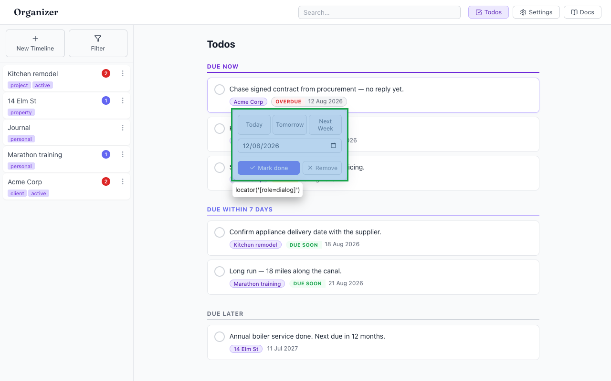
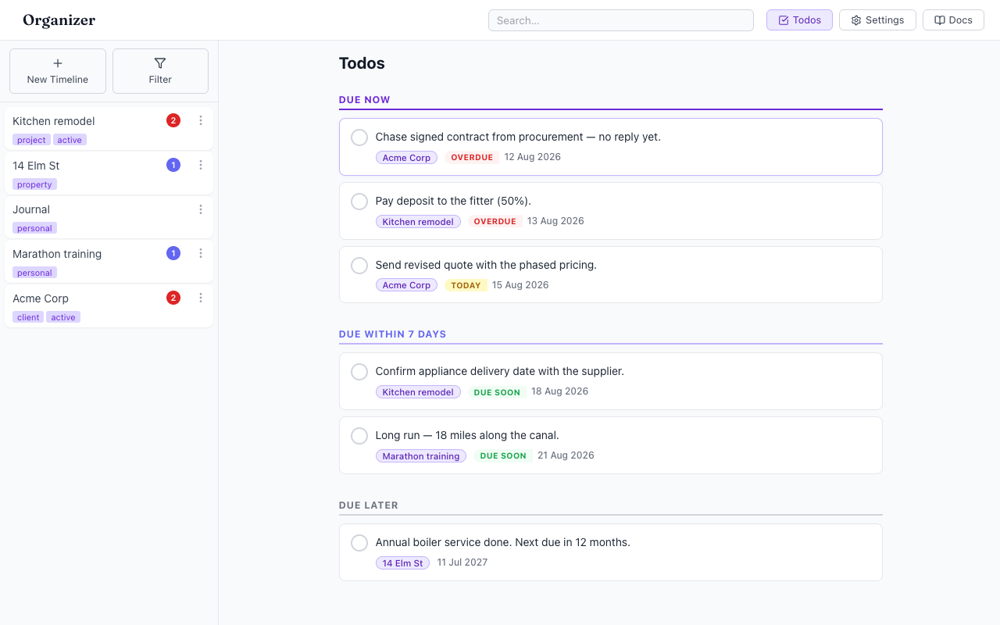
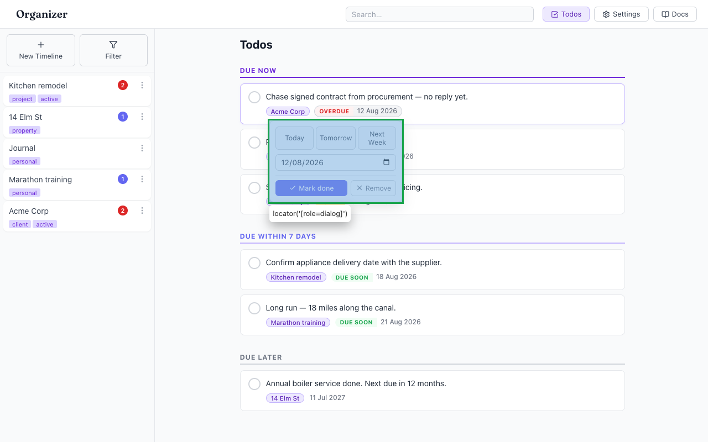

# Due-date popover is dismissed by any scroll, however small

- Area: todos-duedates
- Type: UX
- Severity: Medium
- Screen/route: `#/todos` → `DueDatePopover` scroll handler (`src/components/DueDatePopover/DueDatePopover.tsx:47-57`)
- Repro:
  1. Boot the seeded app and open `#/todos`.
  2. Click a due-date pill to open the popover.
  3. Scroll the todo list even slightly (trackpad nudge, or `.page` scrollTop += 40).
- Observed: The popover closes the instant any scroll occurs — `handleScroll` is bound to `window`'s scroll in capture mode (`window.addEventListener('scroll', handleScroll, true)`) and calls `onClose()`. Because the `.page` list can scroll (~90 px with seeded data, more on smaller screens), a user who opens the popover and then scrolls to see it — or whose trackpad emits an inertial scroll — loses their edit and must reopen it. See ./issue.webm, ./issue-1.png (open) and ./issue-2.png (gone after a 40 px scroll).
- Expected / proposed: Don't dismiss on scroll. Reposition the popover to stay anchored to its trigger while scrolling (recompute `top`/`left`), and only close on Escape, outside click, or selection. The popover already positions correctly at any offset — it just should not self-close.
- Improved demo: ./improved.webm (also ./improved-mockup.png). The app's `window` capture-phase scroll listener runs before any injected listener, so it can't be neutralised live without editing the component; instead the demo scrolls the list *first*, then opens the popover, showing it renders and stays fully usable at a scrolled offset — i.e. reposition-on-scroll is viable. Reloaded to discard.
- Fix pointer: `src/components/DueDatePopover/DueDatePopover.tsx:47-57` — replace `handleScroll = onClose` with a reposition callback (reuse `computePosition(anchorRect, ...)` against a fresh trigger rect), or debounce/ignore small scrolls. Keep the `resize` → reposition behaviour too.
- Effort: S

<!-- media-embed:start -->

## Evidence

### Issue

<video controls preload="metadata" width="720" src="./issue.webm"></video>

### Improved

<video controls preload="metadata" width="720" src="./improved.webm"></video>

<!-- media-embed:end -->
