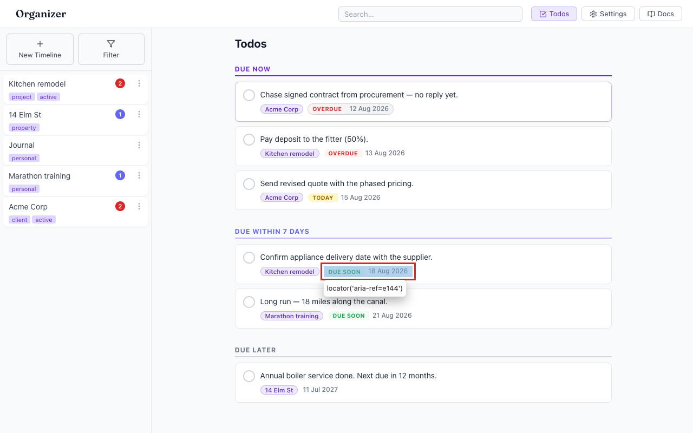
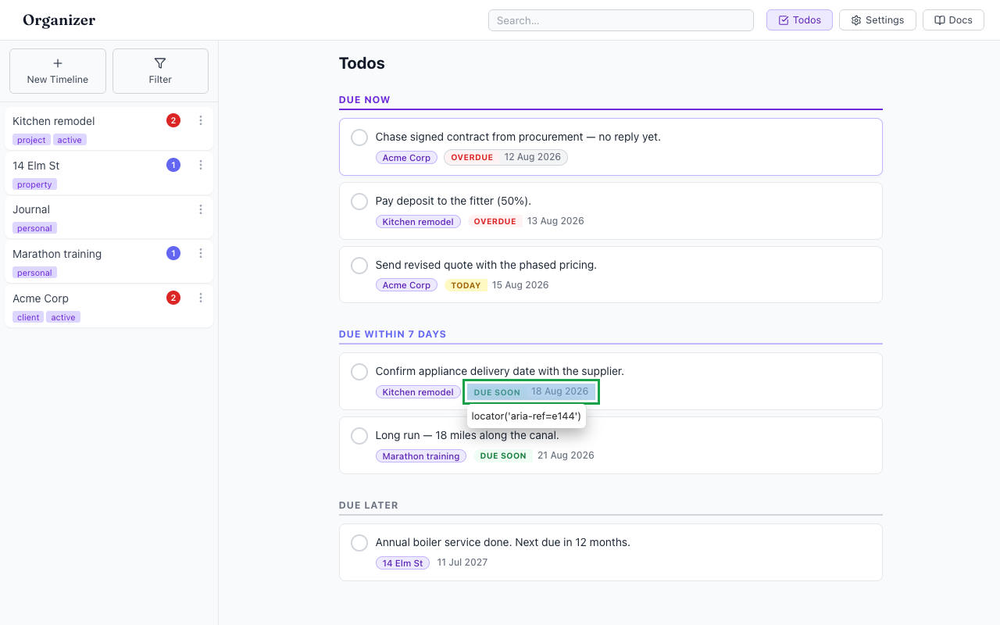

# "DUE SOON" status badge fails WCAG AA contrast (and OVERDUE is marginal)

- Area: todos-duedates
- Type: Style
- Severity: Medium
- Screen/route: `#/todos` → `TodoRow` due-status badges (`src/components/TodoPage/TodoPage.module.css:173-198`)
- Repro:
  1. Boot the seeded app and open `#/todos`.
  2. Look at the "Due Within 7 Days" section — the green **DUE SOON** badge (e.g. "18 Aug 2026").
  3. Measure text-vs-background contrast.
- Observed: The badge text is small (0.65rem ≈ 10 px), bold, uppercase — so it is "small text" and needs **4.5:1**. Actual ratios:
  - `.dueStatusWeek` (DUE SOON): `#16a34a` on `#f0fdf4` = **3.15:1** — fails AA.
  - `.dueStatusOverdue` (OVERDUE): `#dc2626` on `#fef2f2` = **4.41:1** — marginally under 4.5.
  - `.dueStatusToday` (TODAY): `#a16207` on `#fef9c3` = 4.58:1 — passes.
  These badges convey urgency (the whole point of the page), so they are content, not decoration. See ./issue.webm and ./issue-1.png (DUE SOON badge outlined).
- Expected / proposed: Darken the badge text so each meets 4.5:1. DUE SOON → `#15803d` (4.79:1); OVERDUE → nudge to `#b91c1c` or darken the pink background.
- Improved demo: ./improved.webm (also ./improved-mockup.png). Injected `<style>`: `.dueStatusWeek { color:#15803d }`, raising DUE SOON to 4.79:1. Reloaded to discard.
- Fix pointer: `src/components/TodoPage/TodoPage.module.css:185-198` — `.dueStatusWeek` color `#16a34a`→`#15803d`; `.dueStatusOverdue` `#dc2626`→`#b91c1c` (or darker bg). These hard-coded hexes also violate UI_STANDARDS §1 (use design tokens) and §3 (contrast minimums).
- Effort: S

<!-- media-embed:start -->

## Evidence

### Issue

<video controls preload="metadata" width="720" src="./issue.webm"></video>

### Improved

<video controls preload="metadata" width="720" src="./improved.webm"></video>

<!-- media-embed:end -->
