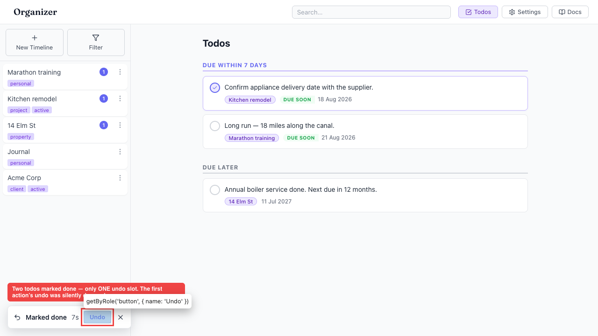
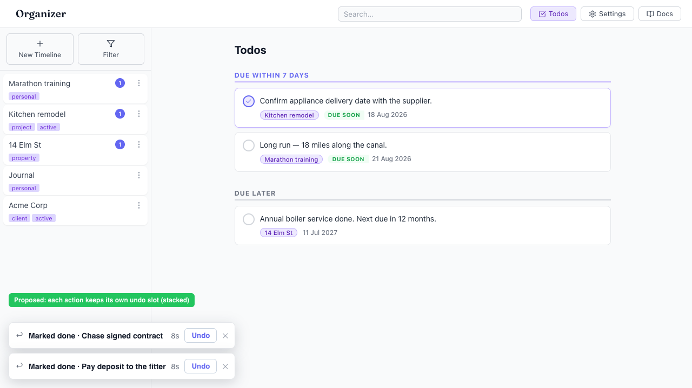

# A second undoable action silently discards the first — only one undo is ever kept

- Area: undo
- Type: UX
- Severity: Medium
- Screen/route: `#/todos` — `src/context/UndoContext.tsx` (`registerUndo` supersedes the pending undo); single-slot `src/components/UndoBar/UndoBar.tsx`
- Repro:
  1. Seed the app and open `#/todos` (6 pending todos).
  2. Click "Mark as done" on the first todo — the undo bar shows "Marked done".
  3. Within the 10s window, click "Mark as done" on a second todo.
  4. Click the single "Undo" button.
- Observed: The bar is a single slot. Registering the second change replaces the first (`registerUndo` calls `clearTimer()` and overwrites `pending`), so the first action becomes permanently non-undoable with no warning. Clicking Undo restores only the **second** todo; the first stays done. In the recording, "Chase signed contract" was marked done first, "Pay deposit" second, and Undo brought back only "Pay deposit" — "Chase" was lost (see ./issue.webm; ./issue-1.png). Users who quickly triage several todos can only ever reverse the last one.
- Expected / proposed: Either (a) stack undo entries so each recent action keeps its own reversible slot for its window (see ./improved-mockup.png), or (b) at minimum make the single-slot limitation obvious — the current design gives no hint that the earlier undo just evaporated. A per-action toast queue matches the merge `ToastStack` pattern already in the app.
- Improved demo: ./improved-mockup.png (injected a throwaway stacked-bar mockup at bottom-left showing two independent "Marked done · …" rows, each with its own Undo + countdown), then reloaded to discard. A live stacked implementation was out of scope for an in-page tweak.
- Fix pointer: `src/context/UndoContext.tsx` — hold `pending` as an array with per-item timers instead of a single slot; `src/components/UndoBar/UndoBar.tsx` — render a stack (mirror `src/components/Toast/Toast.tsx`).
- Effort: M

<!-- media-embed:start -->

## Evidence

### Issue

<video controls preload="metadata" width="720" src="./issue.webm"></video>

### Improved

<!-- media-embed:end -->
