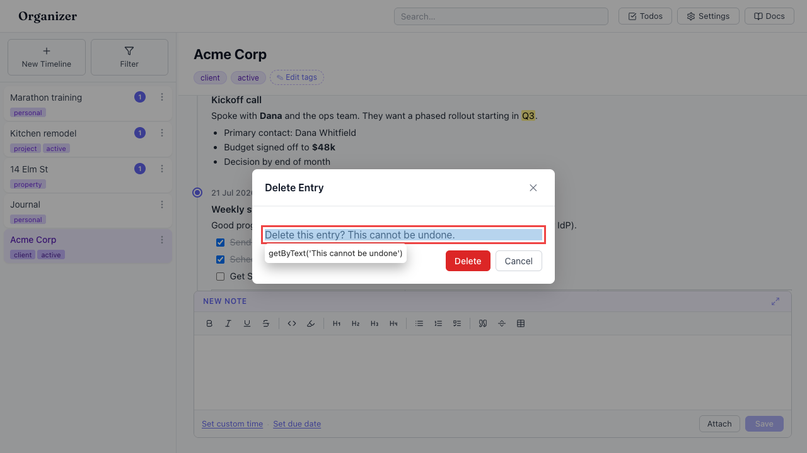

# Deleting an entry offers no undo — only a "cannot be undone" modal

- Area: undo
- Type: UX
- Severity: High
- Screen/route: `#/timelines/<id>` — `src/components/TimelineView/TimelineView.tsx` (delete confirm modal); `src/components/EntryCard/EntryCard.tsx` (per-entry Delete action)
- Repro:
  1. Seed the app and open the "Acme Corp" timeline.
  2. Hover an entry card and click its "Delete entry" action.
  3. Confirm in the "Delete Entry" modal ("Delete this entry? This cannot be undone.").
- Observed: The entry is permanently destroyed. No undo bar appears (verified: no "Undo" control in the DOM after delete — see ./issue.webm; ./issue-1.png shows the "This cannot be undone" modal). This is inconsistent with todos, where a *reversible* dueDate/isDone change already gets a 10s undo bar. A destructive, irreversible delete — the exact case that most needs undo — gets only a modal, and the modal is easy to click through. Entries can contain long rich-text notes and attachments, so accidental loss is costly.
- Expected / proposed: Offer the same undo affordance for entry deletion as for todos: perform the delete, then show "Entry deleted · Undo" for the standard window (soft-delete/restore). This is strictly friendlier than the current modal and could even replace the confirmation dialog. Deletes should flow through `registerUndo` like todo changes do.
- Improved demo: ./improved.webm (throwaway tweak: captured the entry record from IndexedDB before deletion, deleted through the real UI, then injected an "Entry deleted · Undo" bar whose button re-`put`s the entry into the `entries` store and reloads — the deleted entry comes back). Reloaded to discard the injected bar.
- Fix pointer: route entry deletion through `UndoContext.registerUndo` (`src/context/UndoContext.tsx`); capture the `Entry` before `adapter.deleteEntry` in `src/App.tsx`'s delete handler and restore it via `adapter.putEntry` in the undo callback (mirror `src/utils/todoUndo.ts`). Also restore any orphaned attachment blobs.
- Effort: M

<!-- media-embed:start -->

## Evidence

### Issue

<video controls preload="metadata" width="720" src="./issue.webm"></video>

### Improved

<video controls preload="metadata" width="720" src="./improved.webm"></video>

<!-- media-embed:end -->
