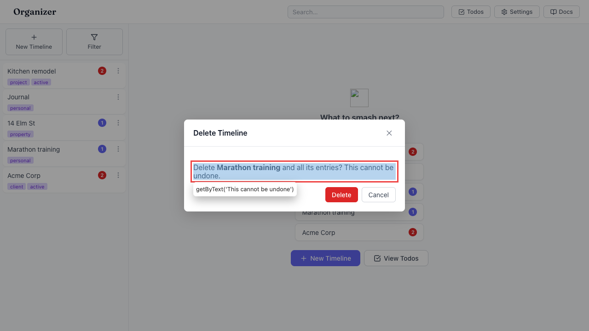

# Deleting a timeline destroys it plus every entry with no undo

- Area: undo
- Type: UX
- Severity: High
- Screen/route: sidebar timeline row → "Timeline options" → Delete — `src/components/TimelineList/TimelineList.tsx` (delete confirm modal); `src/App.tsx` `removeTimeline`
- Repro:
  1. Seed the app (5 timelines).
  2. In the sidebar, open a timeline's "Timeline options" (kebab) menu and choose "Delete".
  3. Confirm in the modal: "Delete <name> and all its entries? This cannot be undone."
- Observed: The timeline and **all of its entries** are permanently removed. No undo bar appears (verified: no "Undo" control after delete — see ./issue.webm; ./issue-1.png). This is the most destructive action in the app (it cascades to every entry and its attachments) yet it is the least recoverable — a single mis-click behind one modal wipes an entire log. Todos, by contrast, get a full 10s undo for a trivially reversible field flip.
- Expected / proposed: Provide undo for timeline deletion (soft-delete + restore), restoring the timeline and all its entries/blobs within the standard window — consistent with the todo undo bar. At minimum the loss should be recoverable for a few seconds.
- Improved demo: ./improved.webm (throwaway tweak: captured the timeline row and its entries from IndexedDB before deletion, deleted through the real UI, then injected a `Deleted "<name>" and N entries · Undo` bar whose button re-`put`s the timeline and all its entries and reloads — the timeline reappears in the sidebar). Reloaded to discard.
- Fix pointer: `src/App.tsx` `removeTimeline` — before `adapter.deleteTimeline`/`deleteEntriesForTimeline`, snapshot the timeline + its entries (+ referenced blobs), then `registerUndo` a callback that restores them (`src/context/UndoContext.tsx`, mirror `src/utils/todoUndo.ts`).
- Effort: L

<!-- media-embed:start -->

## Evidence

### Issue

<video controls preload="metadata" width="720" src="./issue.webm"></video>

### Improved

<video controls preload="metadata" width="720" src="./improved.webm"></video>

<!-- media-embed:end -->
