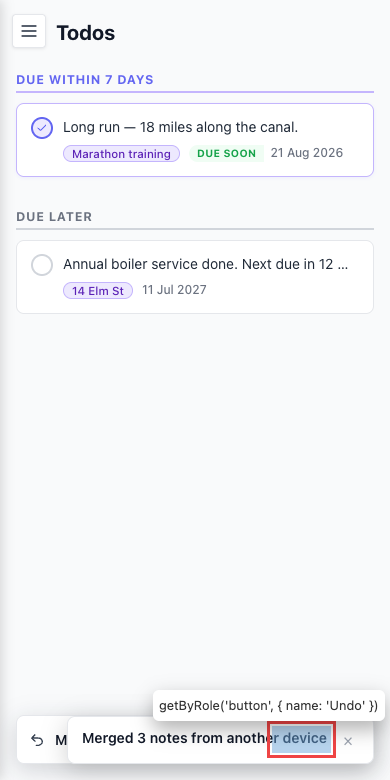
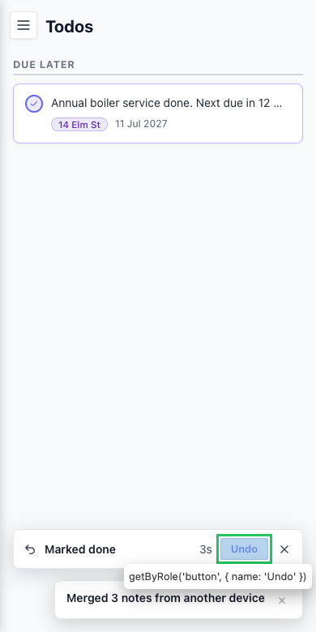

# On mobile the undo bar goes full-width and is covered by the merge toast

- Area: undo
- Type: Bug
- Severity: Medium
- Screen/route: any route at ≤768px — `src/components/UndoBar/UndoBar.module.css` (`@media (max-width:768px)` sets `right:16px; max-width:none`) vs `src/components/Toast/Toast.tsx` (fixed bottom-right, `z-index:10000`)
- Repro:
  1. Set the viewport to a phone width (e.g. 390×780).
  2. Open `#/todos`, mark a todo done — the undo bar appears spanning the full bottom.
  3. Have a cross-device merge toast arrive at the same time (bottom-right, z-index 10000). (In the recording the toast is injected to mirror `ToastStack`; it fires for real from the 2s merge poll in `StorageContext`.)
- Observed: The desktop layout deliberately puts the undo bar bottom-**left** so it "can never collide with the merge ToastStack" (per the CSS comment). But the mobile media query overrides this with `right:16px; max-width:none`, making the bar full-width. Measured at 390px: bar width 358 (right edge 374), toast left edge 67 → `overlap: true`. The toast's `z-index:10000` sits above the bar's `9500`, so the toast covers the Undo/Dismiss buttons at the bar's right edge — the user cannot reach Undo (see ./issue.webm; ./issue-1.png). The anti-collision guarantee is silently broken on the smallest screens, where it matters most.
- Expected / proposed: On mobile, stack the two so neither is obscured — lift the undo bar above the toast stack (or render both in one bottom container that flows vertically). The undo bar must never be covered by a higher-z toast.
- Improved demo: ./improved.webm / ./improved-1.png (throwaway tweak: injected `@media (max-width:768px){ [class*=bar]{ bottom:78px !important; z-index:10001 !important } }` so the undo bar sits above the merge toast and both are fully visible/clickable). Reloaded to discard.
- Fix pointer: `src/components/UndoBar/UndoBar.module.css` mobile block — offset `bottom` above the toast stack height and raise `z-index` above the toast, or coordinate placement with `ToastStack` in `src/components/Toast/Toast.tsx` / `src/context/StorageContext.tsx`.
- Effort: S

<!-- media-embed:start -->

## Evidence

### Issue

<video controls preload="metadata" width="720" src="./issue.webm"></video>

### Improved

<video controls preload="metadata" width="720" src="./improved.webm"></video>

<!-- media-embed:end -->
